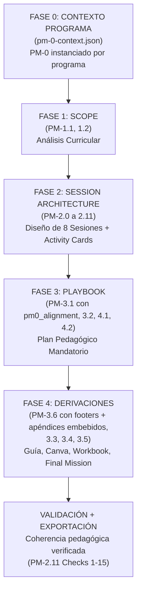

# DOCUMENTO MAESTRO: SISTEMA COMPLETO DE PROMPTS
# FÁBRICA CURRICULAR FPI SENA — BILINGÜISMO

### Instructor Sergio | Abril 2026
---

## 1. PROPÓSITO DEL SISTEMA

El **LG Factory Engine v2.0** es un sistema automatizado de **22 Prompt Modules (PMs)** + **52 arquetipos de actividad** que genera guías de aprendizaje bilingües (Inglés Técnico / ESP) para programas técnicos y tecnológicos del SENA. El sistema diseña **de adentro hacia afuera**: comienza con el diseño curricular (Fase 1), despliega cada Resultado de Aprendizaje (RAP) en 8 sesiones (Fase 2), construye el **Instructor's Playbook obligatorio** (Fase 3), y derivan todos los recursos estudiantiles desde el Playbook (Fase 4).

---

## 2. EL PROBLEMA QUE RESUELVE: LA INVERSIÓN PEDAGÓGICA

### La Arquitectura v1.x (Obsoleta)

La versión anterior generaba **guías de aprendizaje directas**: el sistema producía worksheets, cuestionarios y ejercicios finales sin garantizar que el instructor tuviera un **plan coherente de facilitación**. Resultado:
- Los materiales estudiantiles existían desconectados de la intención pedagógica real.
- No había una **matriz central** que validara la alineación entre competencias, saberes, actividades y evidencias.
- La mejora continua era accidental, no sistemática.

### La Arquitectura v2.0 (Actual): La Revolución Playbook-First

**El cambio fundamental:** La matriz GFPI-F-134 y el Playbook del instructor se convierten en la **fuente de verdad pedagógica**. Ahora:

1. **Fase 1 (Scope):** Analizar el currículo → Produce Competencia + 5 Saberes + Criterios de Evaluación (Columnas 1-5 de GFPI-F-134)
2. **Fase 2 (Session Architecture):** Diseñar la estructura de 8 sesiones → Produce **Activity Cards estructuradas** que llenen Columnas 6-11 de GFPI-F-134
3. **Fase 3 (Playbook — OBLIGATORIO):** Construir el plan detallado de facilitación del instructor → El Playbook es ahora el **documento pedagógico maestro**
4. **Fase 4 (Derivaciones):** A partir del Playbook, derivar guía del aprendiz, Canva deck, workbook, final mission

**Impacto:** El instructor tiene ahora un plan pedagógico claro (Playbook) ANTES de que el estudiante toque cualquier worksheet. Todo lo que el estudiante ve es un reflejo del plan del instructor.

---

## 3. PRINCIPIOS FUNDAMENTALES v2.0

### Principio 1: El Playbook es la Fuente de Verdad

PM-3.1 (Playbook Outline) y PM-3.2 (Playbook Build-Out) son **obligatorios**, no opcionales. El Playbook contiene:
- Mapa de 8 sesiones con flujo pedagógico completo
- Instrucciones de facilitación (SET-UP, WHILE, WRAP-UP)
- Materiales requeridos, alternativas (Plan B), transiciones
- Teacher Talk samples en español e inglés

Sin Playbook, no se avanza a Fase 4. Todos los materiales estudiantes se derivan del Playbook.

### Principio 2: GFPI-F-134 como Contrato Pedagógico Central

La matriz de 11 columnas es el **contrato entre análisis, diseño, facilitación y evaluación**:

| Col | Contenido | Fuente | Responsable |
|-----|-----------|--------|-------------|
| 1-2 | Competencia, RAP | PM-1.2 | Currículum |
| 3-5 | Saberes (conceptos, proceso), Criterios | PM-1.2 | Currículum |
| 6 | Actividades de Aprendizaje (descritas en Activity Cards) | PM-2.1 a PM-2.10 | Diseño |
| 7 | Horas Directas + Autónomas | Activity Cards | Diseño |
| 8 | Evidencias Formales (6 tipos) | Activity Cards | Evaluación |
| 9 | Instrumentos de Evaluación | PM-4.1 derivador | Evaluación |
| 10 | Ambientes, materiales, instructores | Activity Cards | Logística |
| 11 | Criterios de Evaluación detallados | PM-2.11 validador | Evaluación |

PM-2.11 ensambla una fila GFPI-F-134 **completa y validada** al final de Fase 2. Sin esto, las 10 actividades quedan como piezas sueltas.

### Principio 3: Tres Versiones del Mismo Contenido Lingüístico

La habilidad técnica en inglés se práctica en **3 contextos pedagógicos obligatorios**:

1. **Apropiación (Sesiones 2-5):** Donde se enseña y se genera evidencia formal (Reading, Writing, Listening, Speaking, Language Functions, Cuestionario S6)
2. **Evaluación (Sesión 6):** Donde se consolida el cuestionario técnico (25 puntos, 5 habilidades × 5 pts) y se formalizan las evidencias
3. **Autonomía (Sesiones 6½-8, Workbook + Final Mission ABP):** Donde se transfiere sin evaluación formal

El **Workbook (PM-3.4)** estructura cada capítulo en 3 secciones que reflejan esto:
- REINFORCE (refuerzo de Apropiación)
- EXTEND (extensión HOTS)
- PREPARE (pre-activación flipped de Autonomía)

### Principio 4: Antecedente-Consecuente y Continuidad Integralidad

Cada sesión se construye como **flujo causal explícito**:

```
S1 (Reflexión + Contextualización: Bloom L1-2)
  ↓ (antecedente: aprendiz SABE QUÉ)
S2-S5 (Apropiación: Bloom L2-4, Lectura → Escritura → Escucha → Oralidad → Funciones → Gramática)
  ↓ (antecedente: aprendiz SABE HACER)
S6 (Evaluación: Formalización, Cuestionario, 25 pts)
  ↓ (antecedente: aprendiz DEMUESTRA)
S6½-S8 (Transferencia ABP: Aplicación laboral, sin evidencias formales)
  ↓ (consecuencia: aprendiz TRANSFIERE)
```

Cada PM-2.x declara explícitamente: "Esta actividad es antecedente de..." / "Esta actividad es consecuente de..."

### Principio 5: PM-0 como Capa Fundacional Pedagógica (v2.1)

**PM-0 — CEFR Framework & FPI SENA Pedagogical Foundation** es el documento raíz del sistema, obligatorio antes de cualquier diseño de sesión. Establece:

1. **La correspondencia CEFR–FPI**: qué significa A1.1, A1.2, A1.3 en el contexto de programas técnicos del SENA.
2. **Los principios pedagógicos §5.1–§5.13**: desde ESP y realia técnica hasta feedback diferenciado, gestión del L1 y noticing de stress.
3. **El silabus gramatical de 17 grupos y 57+ estructuras** derivado de Life Second Edition (National Geographic Learning), con valores de activación Intro / Consolida / Aplica por guía.
4. **Los descriptores diferenciados por subnivel** (§6): qué puede hacer el aprendiz en A1.1, A1.2, A1.3 y A2.x.
5. **El instrumento de trazabilidad** (§7): lista de 22 ítems para validar que cada sesión cumple los criterios CEFR + pedagógicos + estructurales + evaluativos.
6. **La hoja de ruta A1.1 → A2.x** (§8): progresión de guías con subniveles, focos y evidencias.
7. **La implementación técnica** (§9): tabla L1% por sesión, activación de grupos gramaticales, esquema JSON `pm0_protocol`.

#### El campo `pm0_protocol` en el pipeline

Desde v2.1, **todo JSON de sesión** (`pm-3-2-sX.json`) debe incluir el campo `pm0_protocol` antes de generar el Build-Out DOCX. Este campo es el puente entre los principios teóricos de PM-0 y la práctica de aula:

```
pm0_protocol
├── grammar_groups        — grupos del silabus activos en esta sesión (Intro/Consolida/Aplica)
├── feedback              — modo dominante + técnicas de accuracy + técnicas de fluency
├── l1_management         — porcentaje L1 + English Zone + usos legítimos + estrategia de reducción
├── stress_pronunciation  — palabras foco + técnicas físicas + marcado en tablero
└── success_vocabulary    — términos target + factores SUCCESS aplicados
```

El script `pm-3-2-pm0-patch.js` es la implementación canónica de este campo para G1 DIESEL. Toda nueva guía debe generar su propio script de patch siguiendo el mismo patrón.

**Consecuencia arquitectónica**: ningún Build-Out puede considerarse completo si no incluye el `pm0_protocol`. El instructor necesita saber — en cada sesión — en qué modo de feedback está, qué porcentaje de L1 es apropiado, qué técnicas de stress aplicar y qué factores SUCCESS trabajar con el vocabulario de esa sesión.

---

### Principio 6: Campos Extendidos del Playbook — Ambiente, Estrategia y V+O+C (v2.1)

Además del `pm0_protocol`, el pipeline v2.1 define tres conjuntos de campos extendidos en `pm-3-1.json` que representan decisiones pedagógicas canónicas:

#### 6.1 — Ambiente de Aprendizaje por sesión (`logistics_box.ambiente`)
Cada sesión define el espacio físico exacto: configuración de mesas, equipos requeridos, condiciones del aula. No es una lista de materiales — es la descripción operacional del entorno donde ocurre el aprendizaje. Schema completo en **PM-3.1 §11.1**. Script canónico: `pm-3-1-amb-patch.js`.

#### 6.2 — Estrategia Didáctica Activa + Momento SENA (`logistics_box.estrategia`)
Cada sesión tiene asignada:
- Su **momento del ciclo SENA** (3.1 Reflexión Inicial → 3.2 Contextualización → 3.3 Apropiación → 3.4 Transferencia)
- La **estrategia didáctica dominante** (ABP, ABT, Simulaciones, Evaluación Formativa)
- La **justificación pedagógica** de esa estrategia en esa sesión
- La **técnica específica** por bloque de actividad (A, B, C, D, E)

El campo se propaga a `pm-3-2-sX.json` via `pm-3-2-estrategias-patch.js` y se renderiza en el Build-Out como contexto pedagógico del instructor. Schema completo en **PM-3.1 §11.2**. Taxonomía canónica de técnicas en **PM-3.1 §11.4**.

#### 6.3 — Tabla V+O+C — Dimensiones de Aprendizaje (`voc_dimensions_table`)
Cada sesión tiene descriptores de las tres dimensiones SENA:
- **COGNITIVA (Saber):** verbo cognitivo + objeto + condición
- **PROCEDIMENTAL (Hacer):** verbo procedimental + objeto + condición
- **ACTITUDINAL (Ser):** verbo actitudinal + objeto + condición

La fórmula **V+O+C** (Verbo + Objeto + Condición) garantiza que los descriptores sean medibles, contextualizados y alineados al producto de la sesión. Schema completo en **PM-3.1 §11.3**. Script canónico: `pm-3-1-voc-patch.js`.

#### 6.4 — Sistema de Diseño del Deck (PM-3.3 §11)
El deck visual de cada guía usa una paleta y sistema de personajes canónico. Para DIESEL G1, el contenido completo (paleta `#1C2B3C`/`#F59316`, 3 personajes, Toolbelt 5 categorías × 4 términos, funciones F1-F5) está documentado en **PM-3.3 §11**. El script `pm-3-3-gen.js` actualmente está hardcodeado — refactor pendiente para que lea desde `pm-3-3-spec.json`.

**Regla arquitectónica v2.1**: Un run de DIESEL G1 está completo solo cuando `pm-3-1.json` incluye `ambientes_resumen`, `estrategias_resumen` y `voc_dimensions_table`, y cuando los 8 `pm-3-2-sX.json` incluyen `momento_sena`, `estrategia_didactica` y `pm0_protocol`.

---

### Principio 7: Activity Footer Obligatorio por Actividad (v2.6)

Toda actividad renderizada al aprendiz en **PM-3.5** (Final Mission, 5 sub-fases ABP) y **PM-3.6** (Learning Guide GFPI-F-135, todas las actividades de §3 Actividades de Aprendizaje) debe llevar, al pie, un **Activity Footer de 6 campos obligatorios**:

```
activity_footer
├── ambiente           — Ej: "Ambiente convencional (aula con mesas agrupadas)"
├── estrategia         — Ej: "Aprendizaje Basado en Proyectos (ABP)"
├── tecnica            — Ej: "Mesa redonda", "Toolbelt walk-through", "Role-play por pares"
├── materiales         — Ej: "Papel bond, lapiceros, diccionario ilustrado"
├── material_apoyo     — URLs (unsplash.com / pinterest.com / behance.net / youtube.com / audio .mp3) o "no aplica"
└── duracion_horas     — Ej: "1.75 horas" (cuarto de hora mínimo)
```

**Renderizado:** estilo sutil y casi imperceptible — fuente 7pt gris italic, separadores ` · `, borde superior hairline #D9D9D9 de 4 DXA, labels en italic+bold (`Ambiente:`, `Estrategia:`, etc.). El footer es UN solo párrafo por actividad, comprimido, que no rompe la lectura principal pero deja trazabilidad de logística, pedagogía y duración.

**Razón arquitectónica:** El instructor SENA requiere tener — para cada actividad ejecutable — las 6 dimensiones operacionales pobladas (Ambiente + Estrategia + Técnica = decisión pedagógica; Materiales + Material de apoyo = logística; Duración = gestión del tiempo). Estos 6 campos son la trazabilidad mínima entre el Playbook (PM-3.1 §11.1/§11.2) y la guía del aprendiz, y garantizan que cualquier actividad — sin excepción — pueda ejecutarse sin consultar otros documentos.

**Fuente del contenido:** Los campos de `activity_footer` deben derivarse preferentemente desde `pm-3-1.json` (ambientes_resumen, estrategias_resumen, logistics_box.tecnicas[]) y Activity Cards (duración). Cuando falten, se enriquecen via script canónico `enrich_activity_footers.js` (hardcoded por run — MGV-2026-04-20 es implementación de referencia).

**Regla v2.6:** Ningún pm-3-5.json ni pm-3-6.json puede emitir su DOCX de revisión sin tener `activity_footer` poblado en el 100% de sus actividades. PM-2.11 Check 15 (nuevo en v2.6) valida esta cobertura antes de permitir derivación a Fase 4.

---

### Principio 8: Apéndices Embebidos con Doble Renderizado (v2.6)

Los **Apéndices** (textos de lectura, modelos de escritura, scripts de audio, word walls, briefs de misión, plantillas de planning, fichas de auto-evaluación) aparecen **dos veces** en la Guía del Aprendiz (PM-3.6):

1. **Inline dentro de cada actividad que los referencia** — El aprendiz accede al contenido completo del apéndice EN EL PUNTO EXACTO de la actividad que lo usa. Sin scrollear, sin buscar. Auto-suficiencia de la actividad.
2. **Al final, en el Índice de Apéndices Embebidos** — Para referencia consolidada, lectura secuencial, y uso como material de consulta post-clase.

**Contrato de datos:**

```
pm-3-6.json
├── apendices_embebidos
│   ├── apendice_a_master_anchor_text
│   │   └── contenido_inline: { tipo: "reading_text", ... }
│   ├── apendice_b_andres_sample_font_card
│   │   └── contenido_inline: { tipo: "writing_model", ... }
│   ├── apendice_c_audio_script
│   │   └── contenido_inline: { tipo: "audio_script", ... }
│   ├── apendice_d_word_wall
│   │   └── contenido_inline: { tipo: "word_wall", ... }
│   ├── apendice_e_mission_brief
│   │   └── contenido_inline: { tipo: "mission_brief", ... }
│   ├── apendice_f_planning_canvas
│   │   └── contenido_inline: { tipo: "planning_template", ... }
│   └── apendice_g_self_reflection
│       └── contenido_inline: { tipo: "self_assessment", ... }
└── seccion_3_actividades_aprendizaje
    └── actividades[*].apendices_referenciados: [keys de apendices_embebidos]
```

**Los 7 tipos canónicos de `contenido_inline`:** `reading_text` · `writing_model` · `audio_script` · `word_wall` · `mission_brief` · `planning_template` · `self_assessment`. Cada tipo tiene un dispatcher de renderizado específico en `gen_35_36_docx.js → renderInlineAppendix()`.

**Renderizado inline:** banda de encabezado navy (#1C2B3C) con ícono 📎, cuerpo en fondo claro (#F2F2F2) con bordes navy 3px izquierdo/derecho/inferior. Se inserta ANTES del `activity_footer` de la actividad.

**Mapping canónico (MGV-2026-04-20):**
- A3.3.S2.1 → `apendice_d_word_wall`
- A3.3.S2.2 → `apendice_a_master_anchor_text`
- A3.3.S2.3 → `apendice_d_word_wall`
- A3.3.S3.2 → `apendice_b_andres_sample_font_card`
- A3.3.S4.2 → `apendice_c_audio_script`
- A3.3b.4 → `apendice_e_mission_brief`
- A3.4.1 → `apendice_e_mission_brief`, `apendice_f_planning_canvas`
- A3.4.5 → `apendice_g_self_reflection`

**Razón arquitectónica:** La regla de **auto-suficiencia de la actividad** (REGLA 9, v2.6) exige que el aprendiz no deba cambiar de página, de anexo, ni de documento para ejecutar una actividad. Todo el contenido necesario — texto, modelo, diálogo, plantilla — debe estar en el mismo punto físico del PDF/DOCX donde se le pide hacerlo. El índice al final es para consulta y repaso, no para ejecución.

**Fuente del contenido inline:** Se extrae desde los PMs anteriores (pm-2-3 master anchor text, pm-2-4 move_structure + anti_model_warning, pm-2-6 auditory_anchor_script.transcript, pm-3-5 documento_1_mission_brief y ficha_autoevaluacion, pm-3-6 seccion_5_glosario) via script canónico `embed_apendices.js` (MGV-2026-04-20 es implementación de referencia).

**Regla v2.6:** PM-3.6 no puede emitir DOCX sin que cada `apendices_embebidos[*].contenido_inline` esté poblado con estructura tipada y cada actividad que referencia apéndices tenga su `apendices_referenciados[]` declarado.

---

### Principio 9: PM-0 como Contexto por Run (`pm-0-context.json`) — Fase 0 (v2.6)

La capa fundacional PM-0 (Principio 5) es genérica y cubre A1.1 → A2.x. Cada **programa/guía específica** requiere una **instancia de PM-0 contextualizada al universo narrativo, CEFR, y características del programa**. Esta instancia se llama **`pm-0-context.json`** y es un artefacto OBLIGATORIO de **Fase 0** — se genera ANTES de PM-1.1 y alimenta a todos los PMs posteriores.

**Contenido canónico de `pm-0-context.json`:**

```
pm-0-context.json
├── programa_id                  — Ej: "MGV-2026", "DIESEL-2026", "ADSO-2026"
├── programa_nombre              — Ej: "Desarrollo de Medios Gráficos Visuales"
├── programa_codigo_sofia        — Ej: "522309"
├── tipo                         — "Técnico" | "Tecnológico"
├── rango_cefr                   — Ej: "A1.1 → A2.2" (6 guías)
├── progresion_cefr_decision     — "Opción A (A1.1→A1.2→A1.3→A2.0→A2.1→A2.2)" | "Opción B (A1.1→A1.1+→A1.2→A1.2+→A1.3→A2.0)" | "Otro (definido por instructor)"
├── universo_narrativo           — Personajes, escenarios, empresa ficticia, sector
├── grammar_roadmap              — 17 grupos del silabus PM-0 con activación Intro/Consolida/Aplica por guía (G1..GN)
├── grammar_group_17_sector      — Grupo 17 sector-específico (Ej: "Visual design verbs" para MGV, "Engine troubleshooting modals" para DIESEL)
├── l1_percentage_per_session    — Tabla S1..S8 × GX con % L1 esperado
├── shifts_metodologicos         — Descriptores A1.1 vs A1.2 vs A1.3 etc. (§6 de PM-0)
├── principios_aplicables        — Referencias a §5.1–§5.13 de PM-0 con énfasis por guía
└── pm0_protocol_template        — Plantilla canónica de pm0_protocol para copy-fill por sesión
```

**Uso posterior:**
- **PM-1.1** lee `pm-0-context.json` y lo referencia en su output como `pm0_anchors_ref`. La decisión de 5/10/N bloques se valida contra `rango_cefr` + `progresion_cefr_decision`.
- **PM-1.2** hereda el universo narrativo y el CEFR-target para la guía actual.
- **PM-2.x** y **PM-3.x** consumen `grammar_roadmap`, `l1_percentage_per_session` y `pm0_protocol_template` para poblar `pm0_protocol` por sesión.
- **PM-3.1** construye `pm0_alignment_by_session` (ver Principio 10) usando `pm-0-context.json` como fuente de verdad.

**Razón arquitectónica:** Antes de v2.6, cada guía duplicaba la contextualización (universo, CEFR, grammar roadmap) dentro de pm-1-1.json y pm-1-2.json. Esto generaba drift entre guías del mismo programa. `pm-0-context.json` consolida esta información a **nivel de programa**, no de guía, garantizando que las 6–10 guías de un programa compartan una sola fuente de verdad pedagógica.

**Regla v2.6:** Ningún run puede arrancar (PM-1.1) sin que `pm-0-context.json` exista y haya sido validado manualmente por el instructor. Aplicado por primera vez en MGV-2026-04-20.

---

### Principio 10: Alineación PM-0 ↔ Playbook por Sesión (`pm0_alignment_by_session`) en PM-3.1 (v2.6)

PM-3.1 (Playbook Outline) debe incluir, a nivel raíz del JSON, un arreglo **`pm0_alignment_by_session` de 8 items** (uno por sesión S1..S8) que declare explícitamente:

```
pm0_alignment_by_session: [
  {
    sesion: "S1",
    cefr_descriptors: ["Can greet and introduce self with limited repertoire"],
    grammar_groups_active: { intro: [...], consolida: [...], aplica: [...] },
    l1_percentage_target: "70-80%",
    pedagogical_principles_emphasis: ["§5.1 ESP realia", "§5.4 L1 scaffolding"],
    shifts_from_previous_guide: ["None (first guide)"],
    success_vocabulary_focus: { terminos: [...], factores: [...] }
  },
  ... (S2..S8)
]
```

**Razón arquitectónica:** Antes de v2.6, la alineación entre PM-0 (capa fundacional) y las 8 sesiones del Playbook era implícita — vivía parcialmente en `pm0_protocol` de cada `pm-3-2-sX.json` pero NO se consolidaba en PM-3.1 como contrato pedagógico. El gap se detectó en MGV-2026-04-20 y se corrigió como extensión local v2.5.1-MGV. En v2.6 se promueve a canon del prompt maestro PM-3.1.

**Regla v2.6:** PM-3.1 no es completo sin `pm0_alignment_by_session`. PM-2.11 Check 14 se extiende en v2.6 para validar cross-reference entre `pm0_alignment_by_session[i]` y `pm-3-2-sX.json.pm0_protocol`.

---

### Principio 11: Dos Arquitecturas Data-Flow — LG Engine v3.0 Self-Contained (DIESEL) vs v2.6.x JSON-first (MGV) (v2.6.7)

La fábrica mantiene **dos arquitecturas de data-flow** que conviven por razones históricas y programas-específicas. El instructor debe conocer cuál está vigente en cada run antes de ejecutar cualquier script.

#### 11.1 — LG Engine v3.0 · Self-Contained Edition (canon DIESEL-2026-04-19)

**Filosofía:** El contenido pedagógico vive **hardcoded en los generadores** (módulos `.js`). No hay JSON de datos separado: el generador ES la fuente de verdad. Los archivos `pm-3-2-sX.md` son el formato de lectura humana del mismo contenido.

**Marker de canon:** el DOCX resultante lleva el texto literal `LG Engine v3.0 · Self-Contained Edition` en header/portada.

**Archivos canónicos de un run v3.0:**
- `pm-3-1-playbook-outline.docx` (schema `playbook-outline-v1.0`)
- `pm-3-2-session-build-outs.docx` (schema `session-build-out-v2.0`, 8 sesiones compiladas)
- `pm-3-6-learning-guide.docx` (self-contained, contenido hardcoded en `pm-3-6-new-gen.js` + `pm-3-6-new-gen2.js`, ensamblado por `pm-3-6-assemble.js`)
- `The-Workshop-Specialist-Guia-1-SENA.pdf` (deliverable compilado final)

**Módulos de scripts canónicos DIESEL:**
```
scripts/
├── pm-3-6-assemble.js            — orquestador; invoca sec1/sec2/sec31 + sec32/sec33/sec34
├── pm-3-6-new-gen.js             — módulo sec1/sec2/sec31 (secciones 1, 2, 3.1)
├── pm-3-6-new-gen2.js            — módulo sec32/sec33/sec34 (secciones 3.2, 3.3, 3.4)
└── check-content-uniqueness.js   — CHECK 9 Opción B sibling-only
```

**Paleta DIESEL:** Navy `#1C2B3C` + Orange `#F59316` (NO SENA verde/azul — eso es canon institucional MGV).

**Trade-off:** Self-Contained garantiza un DOCX autocontenido y portable, pero pierde el contrato de datos con upstream (PM-3.1 ↔ PM-3.6 no comparten JSON). Regeneraciones deben validarse por byte-identity o por inspección visual.

#### 11.2 — v2.6.x JSON-first (canon MGV-2026-04-20)

**Filosofía:** Todo el contenido vive en `pm-X-Y.json` (data) y los generadores (`.js`) son renderers puros. Cualquier cambio pedagógico se hace en JSON, nunca en el generador.

**Marker de canon:** schema `activities[]` en pm-3-6.json con 30 actividades estructuradas v2.6.3+.

**Archivos canónicos de un run v2.6.x:**
- `pm-3-1.json` con `ambientes_resumen`, `estrategias_resumen`, `voc_dimensions_table`, `pm0_alignment_by_session` (Principios 6 + 10)
- 8 × `pm-3-2-sX.json` con `pm0_protocol`, `estrategia_didactica`, `momento_sena` (Principios 5 + 6)
- `pm-3-5.json` + `pm-3-6.json` con `activity_footer` 100% cubierto (Principio 7) + `apendices_embebidos` (Principio 8)
- DOCX derivados por `gen_audit_docx.js` o `gen_35_36_docx.js` + `lib/render_seccion4_evidencias.js` (renderer compartido)

**Paleta MGV (= SENA institucional):** Verde `#39A900` + Azul `#0B2E45`.

**Trade-off:** JSON-first permite validadores programáticos (CHECK 9, 13, 14, 15, 16) y evolución pedagógica data-driven, pero requiere pipeline completo (reverse-migration de footers, embedding de apéndices, renderer compartido).

#### 11.3 — Reglas de coexistencia

1. **No mezclar scripts entre canons.** Los 13 scripts v2.6.x relocalizados a `scripts/_mgv-only/` en DIESEL-2026-04-19 NO deben ejecutarse contra datos v3.0 (ver `FORWARD-PORT-PLAN-v3.0.md` §1 matriz de clasificación).

2. **Detectar canon antes de operar.** Un run es v3.0 si existe `pm-3-6-new-gen.js` + marker `LG Engine v3.0 · Self-Contained Edition` en el DOCX. Es v2.6.x si existe `pm-3-6.json` con `activities[]` schema v2.6.3+.

3. **Forward-port script-by-script, no wholesale.** Las mejoras del canon v2.6.x que son conceptualmente portables a v3.0 (parity check, V+O+C coverage validator) deben re-implementarse como scripts nuevos que lean la estructura v3.0, no copiarse.

4. **DIESEL es el canon vigente de referencia** para el instructor Sergio (Friday 2026-04-24 aplicación con grupo de mantenimiento de motores). MGV es canon experimental para evaluación de eficacia comparativa de la fábrica.

5. **CHECK 9 Opción B (sibling-only) es agnóstico al canon**, funciona sobre ambos porque normaliza `PROGRAM-YYYY-MM-DD` antes de hashear y solo compara hermanos de la misma fecha.

**Razón histórica:** Entre 2026-04-19 y 2026-04-21, un rework v2.6.3 → v2.6.6 intentó migrar DIESEL del canon v3.0 al canon JSON-first por analogía con MGV. La migración quedó parcial (.md y .json coexistiendo inconsistentemente), el instructor la declaró un retroceso, y se ejecutó una restauración canónica (2026-04-21 18:15) que devolvió los 3 DOCX v3.0 uploads como ground truth. Este Principio documenta la dualidad definitiva.

---

## 4. ARQUITECTURA DE 4 FASES (+ Fase 0 desde v2.6)



**Nota v2.6:** La Fase 0 se ejecuta una sola vez por **programa** (no por guía). Sus outputs alimentan a todas las guías del programa (G1..GN). Ver Principio 9 para el contrato de `pm-0-context.json`.

### Tabla: Los 22 Prompt Modules

| # | PM | Nombre | Fase | Por-Unidad | v2.0 Status |
|---|----|----|------|-----------|------------|
| 1 | PM-1.1 | Ruta Macrotemática | 1 | 1 | UPDATED — acepta program_context opcional |
| 2 | PM-1.2 | Scope & Sequence + Curación | 1 | 1 | UPDATED — genera Cols 1-5 GFPI-F-134 |
| 3 | PM-2.0 | RAP Session Architect | 2 | 1 | **NEW** — blueprint de 8 sesiones |
| 4 | PM-2.1 | The Spark — Reflexión Inicial | 2 | 1 | UPDATED — emite Activity Card |
| 5 | PM-2.2 | Gap Analysis — Contextualización | 2 | 1 | UPDATED — emite Activity Card |
| 6 | PM-2.3 | Reading — Master Anchor | 2 | 1 | UPDATED — emite Activity Card, Sesión 2 |
| 7 | PM-2.4 | Writing — Task-Based | 2 | 1 | UPDATED — emite Activity Card, Sesión 3 |
| 8 | PM-2.5 | Literacy & Vocabulary Skills | 2 | 1 | UPDATED — emite Activity Card, Sesión 2 |
| 9 | PM-2.6 | Listening — Auditory Anchor | 2 | 1 | UPDATED — emite Activity Card, Sesión 4 |
| 10 | PM-2.7 | Pronunciation — Speaking Skills | 2 | 1 | **DEPRECATED** — funcionalidad en PM-2.8 |
| 11 | PM-2.8 | Speaking — The Mission | 2 | 1 | UPDATED — incluye pronunciation scaffolding |
| 12 | PM-2.9 | Language Functions — Communicative Competence | 2 | 1 | UPDATED — emite Activity Card, Sesión 5 |
| 13 | PM-2.10 | Grammar — Structure Use | 2 | 1 | UPDATED — emite Activity Card, Sesión 5 |
| 14 | PM-2.11 | GFPI-F-134 Row Assembler | 2 | 1 | **NEW** — ensambla 11 columnas |
| 15 | PM-3.1 | Playbook Outline — Session Map | 3 | 1 | **MANDATORY** (was optional) |
| 16 | PM-3.2 | Playbook Build-Out — Step by Step | 3 | 8 | **MANDATORY** (was optional) — 1 por sesión |
| 17 | PM-3.3 | Canva Deck — Visual Support | 4 | 1 | MOVED to Phase 4, derived from Playbook |
| 18 | PM-3.4 | Workbook — Autonomous Work | 4 | 8 | MOVED to Phase 4, derived from Playbook |
| 19 | PM-3.5 | Final Mission — Integrative Task | 4 | 1 | EXPANDED — 5 sub-fases ABP, sin evidencias formales |
| 20 | PM-3.6 | Learning Guide Generator (GFPI-F-135) | 4 | 1 | RENAMED from "GFPI Integrator" |
| 21 | PM-4.1 | Instrumentos de Evaluación Formativa | 3 | 1 | UPDATED — **derivador**, no diseñador; 6 instrumentos |
| 22 | PM-4.2 | Cuestionario Técnico S6 | 3 | 1 | UPDATED — 25 pts (5 skills × 5 pts), not 50 |

---

## 5. LA ESTRUCTURA DE 1 RAP (8 Sesiones × 60 Horas)

Cada RAP despliega exactamente **8 sesiones × 60 horas totales** (48 directas + 12 autónomas):

```
┌─────────────────────────────────────────────────────────────────┐
│ RAP: [Competencia laboral]                                      │
│ Total: 60 horas (48 directas + 12 autónomas)                   │
├─────────────────────────────────────────────────────────────────┤
│ S1 (7.5h): REFLEXIÓN + CONTEXTUALIZACIÓN                       │
│   ├─ PM-2.1 (The Spark): Activación, Bloom L1-2               │
│   └─ PM-2.2 (Gap Analysis): Diagnóstico de saberes previos    │
│   └─ Evidencia: No                                             │
│   └─ SENA phase: Reflexión Inicial + Contextualización        │
├─────────────────────────────────────────────────────────────────┤
│ S2 (7.5h): APROPIACIÓN — LECTURA + VOCABULARIO                 │
│   ├─ PM-2.5 (Vocab Scaffold): Pre-activación léxica           │
│   └─ PM-2.3 (Reading): Master Anchor text, HOTS               │
│   └─ Evidencia: Lectura (Conocimiento) + Vocabulary (5 pts)   │
│   └─ SENA phase: Apropiación                                  │
├─────────────────────────────────────────────────────────────────┤
│ S3 (7.5h): APROPIACIÓN — ESCRITURA + GRAMÁTICA                 │
│   ├─ PM-2.10 (Grammar): Consciousness-raising, structured prac│
│   └─ PM-2.4 (Writing): Task-based production                  │
│   └─ Evidencia: Escritura (Producto) + Grammar (5 pts)        │
│   └─ SENA phase: Apropiación                                  │
├─────────────────────────────────────────────────────────────────┤
│ S4 (7.5h): APROPIACIÓN — ESCUCHA + ORALIDAD                    │
│   ├─ PM-2.6 (Listening): Auditory anchor, TBLT                │
│   └─ PM-2.8 (Speaking): Mission task + pronunciation          │
│   └─ Evidencia: Escucha (Conocimiento) + Oralidad (5 pts)     │
│   └─ SENA phase: Apropiación                                  │
├─────────────────────────────────────────────────────────────────┤
│ S5 (7.5h): APROPIACIÓN — FUNCIONES LINGÜÍSTICAS + SISTEMA       │
│   ├─ PM-2.9 (Language Functions): Competencia comunicativa    │
│   └─ Profundización en estructuras de Sesiones 2-4            │
│   └─ Evidencia: Funciones Lingüísticas (5 pts)                │
│   └─ SENA phase: Apropiación                                  │
├─────────────────────────────────────────────────────────────────┤
│ S6 (7.5h): EVALUACIÓN — CONSOLIDACIÓN                          │
│   ├─ PM-4.2 (Cuestionario S6): 25 puntos, 5 skills × 5 pts   │
│   ├─ Checklists/Rúbricas de Sesiones 2-5                      │
│   └─ Evidencia: Cuestionario Consolidado (5 pts, formalización)
│   └─ SENA phase: Evaluación                                   │
├─────────────────────────────────────────────────────────────────┤
│ S6½-S8 (15h): TRANSFERENCIA — FINAL MISSION ABP                │
│   ├─ PM-3.5 (Final Mission): 5 sub-fases ABP                 │
│   │  • Planeación (qué hacer)                                 │
│   │  • Diseño (cómo hacerlo)                                  │
│   │  • Desempeño (hacerlo en contexto laboral)               │
│   │  • Presentación (comunicar resultado)                     │
│   │  • Evaluación reflexiva (qué aprendí)                    │
│   └─ Evidencia: NO (es transferencia, no evaluación formal)   │
│   └─ SENA phase: Transferencia                               │
└─────────────────────────────────────────────────────────────────┘

TOTALES:
├─ Sesiones de Apropiación (S2-S5): 30h directas (donde vive la evidencia formal)
├─ Sesión de Evaluación (S6): 7.5h directas (consolidación)
├─ Transferencia (S6½-S8): 10.5h directas + 12h autónomas
└─ 6 EVIDENCIAS FORMALES: Reading, Writing, Listening, Speaking, Language Functions, Cuestionario S6
```

---

## 6. LA MATRIZ GFPI-F-134: CONTRATO PEDAGÓGICO

La matriz de planeación pedagógica SENA tiene **11 columnas**. Cada fila = 1 RAP = 60 horas = 8 sesiones.

### Las 11 Columnas

| Col | Nombre | Contenido | Fuente | Validado por |
|-----|--------|-----------|--------|--------------|
| 1 | Competencia | Verbo infinitivo + objeto + contexto laboral (~150 chars) | PM-1.2 | CHECK 1 alineación |
| 2 | RAP | Enunciado Bloom L3+ con condición de desempeño | PM-1.2 | CHECK 1 alineación |
| 3 | Saberes: Conceptos y Principios | 8-10 conceptos clave con jerarquía | PM-1.2 | CHECK 2 cobertura |
| 4 | Saberes: Procesos | 6-8 procedimientos secuenciados | PM-1.2 | CHECK 2 cobertura |
| 5 | Criterios de Evaluación | 4-6 criterios observables | PM-1.2 | CHECK 7 alineación evidencias |
| 6 | Actividades de Aprendizaje | Descripción breve de cada actividad (desde Activity Cards de PM-2.1–2.10) | PM-2.1–2.10 → PM-2.11 | CHECK 5 coherencia arquetipos |
| 7 | Horas (Directo + Autónomo) | Distribución por sesión (S1-S8) | Activity Cards | Suma = 60h (48+12) |
| 8 | Evidencias | 6 tipos formales: Lectura, Escritura, Escucha, Oralidad, Funciones, Cuestionario | Activity Cards | CHECK 7 tipificación |
| 9 | Instrumentos de Evaluación | Referencias a 6 instrumentos (Cuestionario, Checklist, Rúbrica, etc.) | PM-4.1 derivador | Validador CHECK 7 |
| 10 | Ambiente(s) de Aprendizaje | Aula, Laboratorio, Virtual, Campo, Híbrido + materiales + instructores | Activity Cards | Logística CHECK |
| 11 | Criterios de Evaluación Detallados + Reglas de Oro | Descripción operacional de cómo se evalúa cada evidencia | PM-2.11 validador | CHECK 7 trazabilidad |

### Los 4 Criterios Pedagógicos de Validación

1. **Continuidad e Integralidad:** Las 6 habilidades (Reading, Writing, Listening, Speaking, Language Functions, Knowledge) se desarrollan en paralelo y se alimentan mutuamente a través de reciclaje circular de input.

2. **Antecedente-Consecuente:** Cada sesión es una consecuencia lógica de la anterior y un antecedente necesario de la siguiente. No hay saltos.

3. **Economía:** 52 arquetipos + 22 PMs generan 8 guías de aprendizaje (programas técnicos) o 16 guías (programas tecnológicos) sin redundancia.

4. **Alineación de Evidencias:** Las 6 evidencias formales (Cols 8-9-11) están directamente evaluables mediante los 6 instrumentos (Cuestionario S6, Checklists, Rúbricas).

---

## 7. EL INSTRUCTOR'S PLAYBOOK: POR QUÉ ES OBLIGATORIO

En v2.0, el **Playbook (PM-3.1 + PM-3.2) es un requisito previo** antes de que cualquier material estudiantil se genere.

### Contenido del Playbook

**PM-3.1 — Playbook Outline (Session Map):**
- Mapa visual de 8 sesiones con flujo pedagógico
- Qué PM ejecutar en qué sesión
- Objetivos de aprendizaje por sesión
- Materiales y recursos requeridos
- Transiciones y puentes entre sesiones
- Duración estimada de cada actividad

**PM-3.2 — Playbook Build-Out (1 por sesión):**
Para cada una de las 8 sesiones:
- **SET-UP:** Cómo iniciar, materiales, energización, conexión con sesión anterior
- **WHILE:** Instrucciones paso-a-paso de facilitación, Teacher Talk samples en español + inglés simple
- **WRAP-UP:** Síntesis, reflexión del aprendiz, preview de sesión siguiente
- **Logistics Box:** Duración real, roles de instructor, espacios, alternativas (Plan B)
- **Bridge:** Cómo conecta esta sesión con la próxima

### Por Qué es Obligatorio

1. **Fuente de verdad instruccional:** El Playbook es donde vive la **intención pedagógica real**. Sin él, no hay plan.
2. **Validación pedagógica:** El Playbook se revisa y aprueba ANTES de que se generen derivados (Guía, Canva, Workbook). Si hay problemas, se arreglan aquí.
3. **Prerequisito de Fase 4:** PM-3.3, PM-3.4, PM-3.5 y PM-3.6 no pueden ejecutarse sin aprobación de Playbook.
4. **Mejora continua:** El Playbook es revisable y actualizable por experiencia del instructor.

---

## 8. ENTREGABLES DEL SISTEMA (POR RUN)

Cada ejecución completa del sistema produce el siguiente paquete:

### MATERIA PRIMA PEDAGÓGICA

**1 Matriz GFPI-F-134 (11 columnas, 1 fila)**
- Contrato pedagógico completo para 1 RAP (60 horas, 8 sesiones)
- Fuente de verdad para validación

**1 Instructor's Playbook Completo**
- PM-3.1: Session Map (1 documento)
- PM-3.2: Step-by-Step Build-Out (8 documentos, 1 por sesión)
- PM-4.1: 6 Instrumentos de Evaluación Formativa
- PM-4.2: Cuestionario Técnico S6 (25 pts, 5 skills × 5 pts)

### MATERIALES PARA EL APRENDIZ

**1 Guía del Aprendiz (GFPI-F-135)**
- Versión oficial SENA de la guía de aprendizaje
- Generada por PM-3.6 desde Playbook
- Contiene worksheets, competencias, criterios, entregables

**1 Presentación Visual (Canva Deck)**
- 20 slides estructuradas por PM
- Apoyo visual para cada sesión
- Generada por PM-3.3 desde Playbook

**1 Workbook Autónomo**
- 8 capítulos (1 por sesión)
- Cada capítulo: REINFORCE + EXTEND + PREPARE
- Generada por PM-3.4 desde Playbook
- Formatos: PDF imprimible + Digital (Google Classroom)

**1 Final Mission (Integrative Task)**
- Tarea integradora con 5 sub-fases ABP
- Contexto laboral real (simulación o proyecto real)
- Generada por PM-3.5
- Sessions 6½-8, sin evaluación formal

---

## 9. INVENTARIO DE ARCHIVOS DEL MASTER-PROMPTS

| Archivo | Función | Fase | Genera |
|---------|---------|------|--------|
| PM-1.1 — Ruta Macrotemática — 5-10 Bloques.md | Análisis curricular → 5-10 macrotemáticas | 1 | PM-1.2 input |
| PM-1.2 — Scope & Sequence — Desarrollo por Bloque.md | Scope & curación material auténtico → Cols 1-5 GFPI-F-134 | 1 | PM-2.0 input |
| PM-2.0 — RAP Session Architect.md | Blueprint de 8 sesiones × 60h | 2 | PM-2.1 thru PM-2.10 input |
| PM-2.1 — The Spark — Reflexión Inicial.md | Activación / Bloom L1-2 → Activity Card | 2 | S1 entrada |
| PM-2.2 — Gap Analysis — Contextualización.md | Diagnóstico saberes previos → Activity Card | 2 | S1 salida |
| PM-2.3 — Reading — The Master Anchor.md | Reading HOTS + vocabulario → Activity Card | 2 | S2 lectura |
| PM-2.4 — Writing — Task-Based.md | Producción escrita → Activity Card | 2 | S3 escritura |
| PM-2.5 — Literacy & Vocabulary Skills.md | Pre-activación léxica + literacy → Activity Card | 2 | S2 soporte |
| PM-2.6 — Listening — The Auditory Anchor.md | Listening TBLT → Activity Card | 2 | S4 escucha |
| PM-2.7 — Pronunciation — Speaking Skills.md | **DEPRECATED** — funcionalidad en PM-2.8 | — | — |
| PM-2.8 — Speaking — The Mission.md | Speaking task + pronunciation scaffolding → Activity Card | 2 | S4 oralidad |
| PM-2.9 — Language Functions — Communicative Competence.md | Funciones comunicativas → Activity Card | 2 | S5 funciones |
| PM-2.10 — Grammar — Structure Use.md | Grammar scaffolding → Activity Card | 2 | S3, S5 gramática |
| PM-2.11 — GFPI-F-134 Row Assembler.md | Ensamblador: 11 columnas GFPI-F-134 completas | 2 | PM-3.1 input |
| PM-3.1 — Playbook Outline — Session Map.md | Mapa de 8 sesiones + flujo pedagógico | 3 | PM-3.2 input |
| PM-3.2 — Playbook Build-Out — Step by Step.md | Guía de facilitación (1 por sesión, 8 docs) | 3 | Instructor recurso |
| PM-3.3 — Canva Deck — Visual Support.md | Generador Canva deck (20 slides) | 4 | Learner visual resource |
| PM-3.4 — Workbook — Autonomous Work.md | Generador Workbook (1 capítulo/sesión) | 4 | Learner autonomous practice |
| PM-3.5 — Final Mission — Integrative Task.md | Generador Final Mission ABP (S6½-S8) | 4 | Learner transfer task |
| PM-3.6 — GFPI-F-135 Integrator.md | Generador Learning Guide SENA (GFPI-F-135) | 4 | Learner official guide |
| PM-4.1 — Instrumentos de Evaluación Formativa.md | Derivador 6 instrumentos desde Activity Cards | 3 | Instructor assessment |
| PM-4.2 — Cuestionario Técnico — Evidencia de Conocimiento.md | Ensamblador cuestionario S6 (25 pts) | 3 | Learner assessment |
| GFPI-F-134 — Data Contract.md | Especificación de 11 columnas matriz | — | PM-1.2, PM-2.11 referencia |
| Activity Card — Schema.md | Especificación de output Activity Card | — | PM-2.x generan, PM-2.11 consume |
| GFPI-F-135 — Data Contract.md | Especificación de Learning Guide SENA | — | PM-3.6 referencia |

---

## 10. CÓMO CORRER EL SISTEMA: PRIMER RUN PASO A PASO

### PREPARACIÓN (15 minutos)

1. Obtener diseño curricular de SOFÍA Plus:
   - Código programa + nombre
   - Código competencia + enunciado
   - Código RAP + enunciado (verificar si los RAPs vienen pre-numerados N 1..N)
   - Duración total (180h técnico, 350h tecnológico, etc.)

2. Preparar contexto técnico:
   - Sector económico (ej: marítimo, industrial, agrícola, diseño visual)
   - Ambiente productivo descripción
   - Nivel de complejidad

### FASE 0 — CONTEXTO PROGRAMA (v2.6, 45-60 minutos, una sola vez por programa)

**PASO 0:** Generar **`pm-0-context.json`** — instancia de PM-0 contextualizada al programa.
- Input: programa SOFÍA + contexto técnico + rango CEFR objetivo (Ej: A1.1→A2.2)
- **Decisión obligatoria con el instructor:** Elegir progresión CEFR entre:
  - **Opción A (lineal):** A1.1 → A1.2 → A1.3 → A2.0 → A2.1 → A2.2 (1 sub-nivel por guía)
  - **Opción B (con refuerzo):** A1.1 → A1.1+ → A1.2 → A1.2+ → A1.3 → A2.0 (2 guías por sub-nivel)
  - **Otro:** Progresión definida ad-hoc por el instructor
- Construir `pm-0-context.json` siguiendo schema en Principio 9 (§3):
  - `universo_narrativo` (personajes, escenarios, empresa ficticia)
  - `grammar_roadmap` con activación Intro/Consolida/Aplica por guía para los 17 grupos PM-0
  - `grammar_group_17_sector` específico del programa
  - `l1_percentage_per_session` tabla S1..S8 × GX
  - `shifts_metodologicos` A1.1 vs A1.2 vs A1.3 etc.
  - `pm0_protocol_template` plantilla canónica
- Validación: instructor aprueba explícitamente el contexto antes de avanzar a Fase 1.
- Artefacto: `pm-0-context.json` en el directorio raíz del programa (compartido por G1..GN).

### FASE 1 — SCOPE (1-2 horas)

**PASO 1:** Ejecutar **PM-1.1 — Ruta Macrotemática** (v2.7 — flujo formulario + activación manual)

**Sub-paso 1A — Capturar inputs en el Formulario LG Factory (Claude Design):**
- El instructor abre el formulario web del LG Factory (artefacto Claude Design) y diligencia las Secciones A (Programa, una sola vez) y B (Contexto Curricular, una vez por guía).
- El formulario produce dos archivos descargables:
  - `pm-0-context.json` — capa fundacional del programa (Sección A)
  - `pm-1-1-input.json` — input curricular para el prompt PM-1.1 (Sección B)
- **⚠️ NAMING CRÍTICO:** El archivo descargado de la Sección B se llama `pm-1-1-input.json`, NO `pm-1-1.json`. Esto deja claro que es el INPUT del prompt PM-1.1, no el output final del pipeline.
- Guardar los dos archivos en `runs/[RUN-ID]/` (`pm-0-context.json` en raíz; `pm-1-1-input.json` por guía bajo `runs/[RUN-ID]/g[N]/`).

**Sub-paso 1B — Activación manual del prompt PM-1.1 (genera el output final):**
- Abrir una conversación nueva de Claude (claude.ai o API).
- Pegar el master prompt de `master-prompts/PM-1.1 — Ruta Macrotemática — 5-10 Bloques.md` (sección "PROMPT PARA IA").
- Adjuntar los dos archivos JSON: `pm-0-context.json` (contexto del programa) + `pm-1-1-input.json` (input específico de la guía).
- Claude ejecuta la generación según las 6 Reglas de PM-1.1 v2.7 (Regla 1 reformulada: `total_guias` libre, soft warning a 48h, variante Curso Especial con `total_guias=1`).
- Guardar la respuesta de Claude como `pm-1-1.json` en `runs/[RUN-ID]/g[N]/`. Este es el output final que PM-1.2 consumirá.

**⚠️ Validación post-generación:**
- Verificar que `pm-1-1.json` contenga: `pm0_anchors_ref` apuntando al archivo correcto, `tipo` heredado del input, `total_guias` coincidente con el input, `bloques[]` con N elementos (donde N = `total_guias`), `proyecto_formativo_articulador` (omitido si `tipo=Curso Especial` Y `total_guias=1`).
- Si `horas_por_bloque < 48`, el output incluye `horas_por_bloque_warning: true` — el instructor debe confirmar que acepta el ajuste.
- *Lecciones aprendidas: DIESEL-2026-04-15 (técnico ejecutado como tecnológico → 10 bloques incorrectos) y MGV-2026-04-20 (Tecnológico con 6 RAPs pre-numerados → 6 bloques 1:1 correctos) — ambas resueltas en v2.7 al desacoplar `tipo` de `total_guias`.*

**Artefactos generados en este paso:**
- `runs/[RUN-ID]/pm-0-context.json` (del formulario, una vez por programa)
- `runs/[RUN-ID]/g[N]/pm-1-1-input.json` (del formulario, una vez por guía)
- `runs/[RUN-ID]/g[N]/pm-1-1.json` (de Claude ejecutando el prompt PM-1.1, una vez por guía)

**PASO 2:** Ejecutar **PM-1.2 — Scope & Sequence + Curación** (v2.6 estructura 4-bloques)
- Input: 1 macrotemática (ej: "The Hardware Specialist") + `pm-0-context.json` + pm-1-1.json
- Output estructurado en **4 bloques canónicos** (v2.6):
  - **Bloque 0 — Presentación L1:** Texto introductorio de 10 renglones en español explicando el universo narrativo de la guía al aprendiz (onboarding)
  - **Bloque A — Scope + Integrative Task + Evaluation Matrix:** Scope & Sequence completo, descripción de la tarea integradora (Misión Final formativa, no suma), matriz de evaluación de 50 pts formales (E1-E5 × 5pts = 25 pts + E6 Cuestionario Consolidado × 25 pts)
  - **Bloque B — GFPI-F-134 Columnas 1-5:** Competencia, RAP, Saberes (Conceptos + Procesos), Criterios de Evaluación
  - **Bloque C — Curación + Universo:** 3 fichas de curación de fuentes auténticas (Story A reading, Story B listening, Story C refuerzo) + universo narrativo completo de la guía (personajes, escenarios, productos, terminología técnica)
- Seleccionar 2 de las 3 fuentes (Story A → Reading, Story B → Listening)
- Artefacto: pm-1-2.json con los 4 bloques + GFPI-F-134 draft

### FASE 2 — SESSION ARCHITECTURE (3-5 horas)

**PASO 3:** Ejecutar **PM-2.0 — RAP Session Architect**
- Input: GFPI-F-134 cols 1-5 + contexto técnico
- Output: Session Blueprint (8 sesiones × 60h, con asignación de PMs, horas, fases SENA)
- Validar que suma = 60h (48 directas + 12 autónomas)
- Artefacto: PM-2.0 output (Session Blueprint)

> **⚠️ REGLA OPERATIVA v2.6 — SELECCIÓN DE ARQUETIPOS POR EL INSTRUCTOR (ANTES DE EJECUTAR PM-2.x):**
>
> El instructor SELECCIONA explícitamente el arquetipo de cada PM-2.x **ANTES** de que el sistema genere contenido. No hay selección automática ni default silencioso.
>
> **Flujo canónico:**
> 1. Antes de arrancar PASO 4, el sistema presenta al instructor el **catálogo completo de arquetipos de PM-2.1 a PM-2.10** (10 PMs × 4-6 arquetipos cada uno ≈ 52 arquetipos) **en una sola pasada** (no sesión por sesión).
> 2. El instructor elige 1 arquetipo por PM, basándose en el universo narrativo (pm-1-2.json Bloque C), el nivel CEFR (pm-0-context.json grammar_roadmap), y el evento pedagógico objetivo de la guía.
> 3. Las 10 elecciones se consignan en un archivo `arquetipos-elegidos.json` en el directorio del run (ej: `runs/MGV-2026-04-20/arquetipos-elegidos.json`), con estructura `{ pm: "PM-2.3", arquetipo: "Investigative Research", justificacion: "..." }`.
> 4. Solo después de que el instructor apruebe las 10 elecciones, el sistema procede a ejecutar PASO 4.
>
> **Razón arquitectónica:** La selección de arquetipos es una decisión pedagógica crítica que requiere contexto humano (tipo de aprendiz, sector, momento del programa). Delegarla al modelo genera falsos matches. La selección upfront evita iteración re-trabajadora si el arquetipo elegido no encaja con la Activity Card una vez generada.
>
> *Lección aprendida MGV-2026-04-20: instructor eligió manualmente los 10 arquetipos antes de generar pm-2-1.json..pm-2-10.json. Resultado: 0 iteraciones, 0 retrabajos, catálogo completado en una pasada.*

**PASO 4:** Ejecutar **PM-2.1 a PM-2.10** (en secuencia: APERTURA → CONJUNTO A → CONJUNTO B → CONJUNTO C)
- For each PM:
  - Input: PM anterior output (cadena) + instrucciones de arquitectura + **`arquetipos-elegidos.json`** (v2.6)
  - El arquetipo ya está pre-seleccionado por el instructor (no lo elige el LLM)
  - Output: Activity Card estructurada + contenido pedagógico completo
  - Validar Activity Card llena Cols 6-10 GFPI-F-134

> **⚠️ REGLA CRÍTICA — UNIVERSO DE CONTENIDO ORIGINAL POR GUÍA:**
> Cada pm-2-x (pm-2-1 a pm-2-11) y cada pm-3-2-sX (S1–S8) **debe ser generado desde cero** a partir del universo de contenido de SU guía (bloques + CEFR + fuentes curadas propias). **NUNCA** copiar estos archivos de otra guía y cambiar solo el `run_id`. Este error produce documentos con contenido pedagógico incorrecto — el texto de lectura, el diálogo de listening, los ejercicios de vocabulario, las tareas de escritura y las actividades de sesión son todos de la guía donante, no de la guía que se está construyendo.
>
> **Archivos que DEBEN ser originales por guía (no pueden ser copia):**
> - `pm-2-3.json` — Texto de lectura (Story A): debe ser el texto auténtico adaptado de las **fuentes curadas de ESA guía** (src-A en pm-1-2.json)
> - `pm-2-5.json` — Vocabulario: debe usar los **30 términos de ESA guía** (key_vocabulary de pm-1-2.json) con ejercicios del nivel CEFR correcto
> - `pm-2-6.json` — Diálogo de listening: debe ser el diálogo de ESA guía (src-B en pm-1-2.json), con los personajes y datos técnicos del universo de ESA guía
> - `pm-2-4.json` — Tarea de escritura: debe corresponder al formulario/producto de ESA guía (Inspection Form, RCA Report, Risk Assessment, etc.)
> - `pm-2-8.json` — Tarea speaking: contexto técnico de ESA guía
> - `pm-2-9.json` — Language functions F1–F5: ejemplos del universo técnico de ESA guía
> - `pm-2-10.json` — Grammar items: estructuras del nivel CEFR de ESA guía con ejemplos de su vocabulario técnico
> - `pm-3-2-s1.json` a `pm-3-2-s8.json` — Contenido completo de cada sesión: todas las actividades, textos, Teacher Talk y materiales deben ser originales de ESA guía
>
> **Lo que SÍ puede reutilizarse entre guías (estructura, no contenido):**
> - Los **scripts generadores** `.js` — misma arquitectura, solo actualizar `run_id`
> - Los **campos estructurales** de pm-2-0.json (horas, fases SENA) — misma estructura, nuevo contenido de sesiones
> - Los **formatos** de pm-3-1.json, pm-4-1.json, pm-4-2.json — estructura igual, poblada con contenido de la guía correcta
>
> *Lección aprendida DIESEL-2026-04-18 G3–G5: pm-2-1 a pm-2-11 y pm-3-2-s1 a pm-3-2-s8 copiados de G2 con solo `run_id` reemplazado. Los documentos generados contenían el universo de B3+B4/A1.2 en las guías G3 (B5+B6/A1.3), G4 (B7+B8/A2.0) y G5 (B9+B10/A2.1). Error detectado post-generación 2026-04-18. Corrección en curso.*

**PASO 5:** Ejecutar **PM-2.11 — GFPI-F-134 Row Assembler**
- Input: 10 Activity Cards (PM-2.1 a PM-2.10) + PM-1.2 Cols 1-5 + Session Blueprint
- Output: Fila GFPI-F-134 **completa y validada** (11 columnas pobladas)
- Incluye Validation Report (CHECK 1, 2, 5, 7)
- Artefacto: GFPI-F-134 row final + Validation Report

### FASE 3 — PLAYBOOK (2-3 horas, OBLIGATORIO)

**PASO 6:** Ejecutar **PM-3.1 — Playbook Outline**
- Input: GFPI-F-134 fila + Session Blueprint + `pm-0-context.json`
- Output: Mapa de 8 sesiones con flujo pedagógico, objetivos, materiales, transiciones + **`pm0_alignment_by_session[]` array de 8 items** (v2.6, ver Principio 10)
- Artefacto: PM-3.1 Playbook Outline

**⚠️ PASO 6.b — `pm0_alignment_by_session` canónico (v2.6, obligatorio):**
- Verificar que `pm-3-1.json` contiene el arreglo `pm0_alignment_by_session` de exactamente 8 items (S1..S8).
- Cada item debe tener: `sesion`, `cefr_descriptors`, `grammar_groups_active` (intro/consolida/aplica), `l1_percentage_target`, `pedagogical_principles_emphasis`, `shifts_from_previous_guide`, `success_vocabulary_focus`.
- Los valores deben derivar directamente de `pm-0-context.json` (grammar_roadmap, l1_percentage_per_session, shifts_metodologicos, principios_aplicables).
- **Validación cross-reference (v2.6):** PM-2.11 Check 14 extendido valida que `pm0_alignment_by_session[i].grammar_groups_active` sea consistente con `pm-3-2-sX.json[i].pm0_protocol.grammar_groups`.
- Si falta el array o hay inconsistencias: STOP — regenerar PM-3.1 hasta pasar.
- *Lección aprendida MGV-2026-04-20: gap documentado como BUG-PM31-001 en el prompt maestro PM-3.1; corregido como extensión local v2.5.1-MGV; promovido a canon en v2.6.*

**PASO 7:** Ejecutar **PM-3.2 — Playbook Build-Out** (8 veces, una por sesión)
- Input: PM-3.1 + Session Blueprint + `pm-3-1.json.sessions[i].logistics_box` (estrategias por sesión)
- For S1-S8:
  - Output A: Guía de facilitación en prosa (SET-UP, WHILE, WRAP-UP, Logistics, Bridge) con Teacher Talk samples bilingües
  - Output B: Artefacto JSON `pm-3-2-sX.json` que cumple el **Required Output Schema (v2.5)** declarado en PM-3.2 — incluye `momento_sena`, `estrategia_didactica`, `justificacion_didactica` a nivel raíz + `tecnica_didactica` por cada bloque `while_*`
- Artefacto: 8 documentos PM-3.2 (.md + .json por sesión)

**⚠️ PASO 7.b — Verificar propagación de estrategias didácticas (v2.5, obligatorio):**
- Para cada `pm-3-2-sX.json` generado, confirmar que contiene los 4 campos pedagógicos (`momento_sena`, `estrategia_didactica`, `justificacion_didactica`, y al menos 3 `while_*.tecnica_didactica` poblados).
- Si el LLM emitió los campos nativamente (flujo v2.5 ideal), continuar.
- Si los campos están ausentes o incompletos, ejecutar el script fallback `pm-3-2-estrategias-patch.js` que lee `pm-3-1.json.sessions[i].logistics_box` y los inyecta en cada `pm-3-2-sX.json`.
- Validación final: `pm-2-11.json.validation_report.checks.strategy_propagation.passed == true` (Check 14 de PM-2.11). Si falla, STOP — regenerar PM-3.1 y/o PM-3.2 hasta pasar.
- *Lección aprendida DIESEL-2026-04-19: el patch no se ejecutó y los 8 `pm-3-2-sX.json` quedaron sin `estrategias_resumen`/`momento_sena`/`tecnica_didactica`. Corrección en v2.5: PM-3.2 ahora declara el schema como obligatorio y PM-2.11 Check 14 lo valida.*

**PASO 8:** Ejecutar **PM-4.1 — Instrumentos de Evaluación Formativa** (DERIVADOR)
- Input: 6 Activity Cards formales (PM-2.3, 2.4, 2.6, 2.8, 2.9, + Cuestionario S6)
- Output: 
  - Cuestionario Reading (PM-2.3)
  - Checklist Writing (PM-2.4)
  - Checklist Listening (PM-2.6)
  - Checklist Speaking (PM-2.8)
  - Checklist Language Functions (PM-2.9)
  - (Framework para Cuestionario S6 consolidado)
- Artefacto: 5 instrumentos PDF

**PASO 9:** Ejecutar **PM-4.2 — Cuestionario Técnico S6**
- Input: PM-4.1 + Activity Cards de S2-S5
- Output: Cuestionario consolidado S6 (25 puntos, 5 skills × 5 pts)
- Artefacto: Cuestionario S6 PDF

**REVISIÓN + APROBACIÓN DE PLAYBOOK:**
- Instructor revisa PM-3.1 + PM-3.2 + PM-4.1 + PM-4.2
- Si hay cambios: iterar PM-3.2 y PM-4.1 hasta aprobación
- **NO avanzar a Fase 4 sin aprobación explícita**

### FASE 4 — DERIVACIONES (2-3 horas, POST-APROBACIÓN PLAYBOOK)

**PASO 10:** Ejecutar **PM-3.6 — Learning Guide Generator**
- Input: Playbook + GFPI-F-134 fila + pm-2-3.json + pm-2-4.json + pm-2-6.json + pm-3-5.json (para contenido de apéndices embebidos)
- Output: Guía del Aprendiz (GFPI-F-135 formato oficial SENA)
- **⚠️ REQUISITOS v2.6 — OBLIGATORIOS antes de emitir DOCX:**
  - Cada actividad de §3 (Actividades de Aprendizaje) debe tener `activity_footer` poblado con los 6 campos (Principio 7)
  - Cada `apendices_embebidos[*]` debe tener `contenido_inline` con estructura tipada (7 tipos canónicos — Principio 8)
  - Cada actividad que referencie apéndices debe tener `apendices_referenciados: []` declarado
  - Renderizado DOCX: apéndices aparecen **inline dentro de cada actividad referenciadora** + **al final como índice** (doble render)
- Script canónico de enriquecimiento: `enrich_activity_footers.js` + `embed_apendices.js` (MGV-2026-04-20 es implementación de referencia)
- Artefacto: GFPI-F-135 PDF/Word con activity_footer + apéndices doble render

**PASO 11:** Ejecutar **PM-3.3 — Canva Deck**
- Input: Playbook + objetivos por sesión
- Output: 20 slides Canva (apoyo visual)
- Artefacto: Canva link (editable) + exportado PDF

**PASO 12:** Ejecutar **PM-3.4 — Workbook**
- Input: Playbook + Activity Cards S2-S8
- Output: 8 capítulos (1 por sesión: REINFORCE + EXTEND + PREPARE)
- Artefacto: Workbook PDF imprimible + Google Classroom version

**PASO 13:** Ejecutar **PM-3.5 — Final Mission**
- Input: Playbook + Transferencia context + simulación laboral
- Output: Mission Brief + 5 sub-fases ABP + plantilla producto/artefacto
- **⚠️ REQUISITO v2.6 — OBLIGATORIO:** Cada una de las 5 sub-fases ABP (plan, design, perform, present, assess) debe tener `activity_footer` poblado con los 6 campos (Principio 7). Script canónico: `enrich_activity_footers.js`.
- Artefacto: Final Mission PDF + Rubric con activity_footer por sub-fase

**VALIDACIÓN + EXPORTACIÓN:**
- Run 4 coherence checks (CHECK 1, 2, 5, 7)
- Generate Validation Report
- Export all outputs: GFPI-F-135, Playbook, Instruments, Canva, Workbook, Final Mission
- **⚠️ ARTEFACTO OBLIGATORIO — Scripts del pipeline:**
  - Copiar todos los scripts `.js` del generador a `runs/[RUN-ID]/scripts/`
  - Sincronizar a vault: `fpi-sena-factory-vault/runs/[RUN-ID]/scripts/`
  - Sin este paso, los generadores se pierden al cerrar la sesión y deben reconstruirse
  - Aplica a cualquier programa, cualquier run, cualquier sesión de trabajo
- **⚠️ CHECK OBLIGATORIO — Unicidad de contenido (G5 Validation CHECK 9):**
  - Verificar que pm-2-3, pm-2-5, pm-2-6 no son byte-idénticos a la misma guía anterior
  - Comando de verificación: comparar hash SHA de los archivos de contenido entre runs
  - Si son idénticos (salvo run_id): **STOP** — el contenido pedagógico debe regenerarse desde el universo de ESA guía
  - Este check previene el error de "copia fantasma": documentos con run_id correcto pero contenido de otra guía
- Artefactos finales: carpeta del run con todos los documentos + subcarpeta `scripts/`

---

## 11. HISTORIAL DE VERSIONES

### v2.12 — Canonización Opción A: jerarquía canónica directiva > operacional > master prompt + PM-2.1/PM-2.2 v3.0 con 2 modos — 2026-04-28

**Contexto:** Durante la sesión arquitectónica de Fase 2 (PLAN-FASE-2-ARQUITECTURA.md v1.1 → v1.3), Sergio detectó una "discrepancia" aparente entre los runs DIESEL (que aplicaban 4 arquetipos a PM-2.1/PM-2.2 con `archetype_mode: "secuencia encadenada"`) y MGV-2026-04-20 (que respetaba el master prompt original "DETONANTE/DIAGNÓSTICO ÚNICO" marcando `applicable_to_this_pm: false`). La investigación reveló que NO era discrepancia — era una jerarquía canónica que el sistema no había documentado.

**Reconocimiento de la jerarquía canónica de autoridad (NUEVO):**

El sistema FPI SENA tiene 3 niveles de autoridad canónica que deben respetarse en orden:

| Nivel | Fuente | Autoridad | Ejemplo |
|---|---|---|---|
| **1** | Directiva del instructor | MÁXIMA | "Quiero todos los arquetipos para todos los PM" (capturada en MGV pm-2-11.json:574) |
| **2** | Implementación operacional canonizada | Refleja directiva | DIESEL `archetype_used [N]` + `archetype_mode "secuencia encadenada"` aplicado a TODOS los PMs · MGV `integration_all_archetypes_policy` con N arquetipos |
| **3** | Master prompts canon | Debe actualizarse cuando contradiga niveles 1-2 | PM-2.1/PM-2.2 v2.0 decían "ÚNICO" — desactualizado respecto a directiva nivel 1 |

**Decisión arquitectónica Sergio 2026-04-28 (Opción A canonizada):**

La directiva del instructor "Quiero todos los arquetipos para todos los PM" aplica también a PM-2.1 y PM-2.2 (no son excepción). Master prompts PM-2.1.md y PM-2.2.md actualizados a v3.0 con 2 modos:

- **Modo DEFAULT** (`mgv_compendio_metodologico` con 1 arquetipo): preserva el patrón histórico — PM-2.1 con "Narrative Scenario" (EXPLORE/ENGAGE/DISCOVER) y PM-2.2 con "The Mirror" (WHAT-I-KNOW/BLIND-SPOTS/LEARNING-CONTRACT). Sigue siendo válido.
- **Modo EXTENSIBLE** (`diesel_secuencia_encadenada` con 4 arquetipos): canoniza el patrón DIESEL operacional. Catálogos canonizados:
  - PM-2.1: A Visual/Infografía · B Story/Narrativa · C News/Noticia técnica · D Debate/Encuesta
  - PM-2.2: A Self-assessment/KWL · B Diagnosis visual · C Gap card · D Peer interview

El instructor declara modo en `runs/[RUN-ID]/arquetipos-elegidos.json` por run.

**Lección sistémica:**

Cuando un master prompt y la realidad operacional de runs maduros se contradicen, NO es necesariamente discrepancia — puede ser jerarquía canónica no reconocida. Las directivas del instructor capturadas en runs reales tienen autoridad sobre master prompts antiguos. **Patrón meta:** antes de declarar "discrepancia", buscar la directiva del instructor literal en pm-2-11.json del run más maduro · si existe, el master prompt es lo que debe actualizarse, no el comportamiento operacional.

**Archivos actualizados en v2.12:**
- `master-prompts/PM-2.1 — The Spark — Reflexión Inicial.md` → v2.0 → v3.0 (2 modos canonizados)
- `master-prompts/PM-2.2 — Gap Analysis — Contextualización.md` → v2.0 → v3.0 (2 modos canonizados)
- `master-prompts/PLAN-FASE-2-ARQUITECTURA.md` → v1.2 → v1.3 (§11.5 RESUELTO con Opción A)
- `master-prompts/DOCUMENTO MAESTRO ... .md` → v2.11 → v2.12 (esta entrada)

**Implicaciones para Fase 2 (cuando arranque):**
- Hito 1 (§11.5 del plan) ahora desbloqueado — jerarquía canónica documentada
- Subagentes PM-2.1/PM-2.2 deben leer `arquetipos-elegidos.json` y ramificar según `estilo: "mgv_compendio_metodologico"` vs `estilo: "diesel_secuencia_encadenada"`
- MGV-2026-04-20 pm-2-1.json + pm-2-2.json pueden regenerarse retroactivamente en modo extensible cuando se ejecute Fase 2 sobre MGV en producción real

---

### v2.11 — Correcciones canónicas: 4 patrones regla_bloques + asimetría tipo-programa (proyecto formativo vs final_mission_scenario) — 2026-04-27

**Contexto:** Durante el probe IMARPOR-CC (variante single-guía 100h del programa Inglés Marítimo y Portuario), Instructor Sergio detectó dos simplificaciones erróneas que la v2.7 había introducido. Las dos correcciones se aplican en PM-1.1 v2.7 → v2.7.1.

**Corrección 1 — Restaurar `regla_bloques` con enum de 4 patrones canónicos:**

La v2.7 había ELIMINADO `regla_bloques` asumiendo que el patrón implícito (`alineacion_1a1`) cubría todo. Sergio señaló la pregunta crítica: *"¿cuándo sean programas técnicos o tecnológicos que requieran varias guías por RAP?"*. La realidad SENA tiene al menos 4 patrones legítimos:

| Patrón | Significado | Caso de uso |
|--------|-------------|-------------|
| `alineacion_1a1` | 1 RAP = 1 guía | MGV (6 RAPs → 6 guías) |
| `absorcion_Na1` | N RAPs absorbidos en 1 guía única | IMARPOR-CC (4 RAPs → 1 guía 100h) |
| `desdoblamiento_1aN` | 1 RAP desdoblado en N guías | RAP complejo subdividido pedagógicamente |
| `alineacion_NaM` | Mapeo libre N RAPs ↔ M guías | Programa con agrupaciones híbridas |

`regla_bloques` se RESTAURA como campo OBLIGATORIO en pm-1-1.json con enum cerrado a estos 4 valores.

**Corrección 2 — Asimetría tipo-programa para proyecto formativo:**

La v2.7 trataba `proyecto_formativo_*` como campo opcional uniforme. Sergio señaló: *"Cuando es un curso complementario no hay proyecto formativo. Proyecto formativo fase hace parte de eso también. Lo que hay es una final misión. Pero eso ya tiene que ver con la fase 2."*

Asimetría canónica corregida:

| Tipo | proyecto_formativo (con fases articuladas) | final_mission_scenario |
|------|--------------------------------------------|------------------------|
| Técnico | ✓ Obligatorio | ✓ Uno por guía (Fase 2) |
| Tecnológico | ✓ Obligatorio | ✓ Uno por guía (Fase 2) |
| Curso Especial | ✗ NO aplica | ✓ Uno integral del curso |
| Curso Complementario | ✗ NO aplica | ✓ Uno integral del curso |

Cursos Complementarios/Especiales NO tienen proyecto formativo en SENA — solo Misión Final. Lo que parece "proyecto formativo fase" en programas complementarios es realmente el escenario integral de la Misión Final (que es Fase 2). Para no confundir nomenclatura, se introduce el campo `final_mission_scenario` exclusivo para cursos cortos.

**Lección sistémica:**

Mi v2.7 fue una simplificación honesta pero perdió 3 patrones canónicos legítimos de mapping RAP↔guía + olvidó la asimetría arquitectónica entre programas titulados (con proyecto formativo) y cursos cortos (sin él). El probe IMARPOR-CC expuso ambos en menos de 5 minutos. **Patrón meta:** cada vez que se "simplifica" el canon (eliminando campos, asumiendo defaults uniformes), revisar primero contra los 4 tipos de programa existentes (Técnico, Tecnológico, Especial, Complementario) y los N RAPs↔M guías posibles. Sin esa revisión cross-tipo, la simplificación pierde casos reales.

**Archivos actualizados en v2.11:**
- `master-prompts/PM-1.1 — Ruta Macrotemática — 5-10 Bloques.md` → v2.7 → v2.7.1
- `form-schema-pm0-pm11.json` → enum regla_bloques + lógica condicional UX (en proceso)
- `runs/IMARPOR-rework-2026-04-25/gaps-encountered.md` → GAP 4 + GAP 5 documentados
- (Pendiente) `v4/schemas/pm-1-1.schema.json` → re-derivar desde canon completo (Path B)

---

### v2.10 — Formulario LG Factory + PM-1.1 v2.7 (desacople tipo/total_guias) — 2026-04-26

**Contexto**: Instructor Sergio formaliza el flujo de captura de inputs vía Formulario LG Factory (artefacto Claude Design) y refactoriza PM-1.1 para desacoplar el `tipo` (metadata SENA) del `total_guias` (decisión pedagógica libre).

**Cambios principales:**

1. **PM-1.1 v2.7** — Regla 1 reformulada:
   - Eliminado `regla_bloques`. La alineación 1 RAP = 1 bloque pasa de excepción a patrón implícito por defecto.
   - `tipo` (Técnico / Tecnológico / Curso Especial) deja de determinar el número de bloques. Es solo metadata administrativa de certificación SENA.
   - `total_guias` se decide libremente por el instructor según la lógica del diseño curricular.
   - Soft warning a 48h/bloque (no bloquea export, útil para micro-guías legítimas).
   - Variante Curso Especial con `total_guias=1`: omite "proyecto formativo articulador"; Misión Final = entrega completa del curso.

2. **Formulario LG Factory** — flujo de captura formal:
   - Artefacto Claude Design (React + shadcn) que diligencia Sección A (Programa) + Sección B (Contexto Curricular) + Sección C (Aprobaciones).
   - Genera `pm-0-context.json` (Sección A, una vez por programa) y `pm-1-1-input.json` (Sección B, una vez por guía).
   - **Naming crítico:** el output del formulario para Sección B se llama `pm-1-1-input.json`, NO `pm-1-1.json`. Diferencia explícita entre INPUT del prompt PM-1.1 vs OUTPUT final del pipeline.

3. **PASO 1 del DM §10** — reescrito en dos sub-pasos:
   - **Sub-paso 1A:** capturar inputs en el formulario web → descarga `pm-0-context.json` + `pm-1-1-input.json`
   - **Sub-paso 1B:** activación manual del prompt PM-1.1 — abrir Claude, pegar master prompt PM-1.1, adjuntar los dos JSONs, guardar respuesta como `pm-1-1.json` final.

4. **Catálogos PM-0 expuestos en el formulario:**
   - 13 principios pedagógicos §5.1–§5.13 con tooltip mostrando resumen
   - Descriptores CEFR por subnivel (A1.1–A2.2) que pre-rellenan automáticamente al elegir `guia_subnivel_cefr`
   - 5 plantillas del Grupo Gramatical 17 (DIESEL/MGV/MARÍTIMO/ADSO/Personalizado)

**Artefactos generados en este bloque:**
- `Formulario-PM0-PM1.1.docx` (versión imprimible del formulario, branding SENA)
- `Formulario-PM0-PM1.1.xlsx` (versión spreadsheet con dropdowns + JSON Preview)
- `form-schema-pm0-pm11.json` (schema canónico v2.7 con catálogos completos PM-0)
- `claude-design-prompt.md` (prompt para construir el formulario en Claude Design + DELTA v2.7 + DELTA v2.7.1)
- Artefacto Claude Design (formulario web React)

**Lecciones consolidadas en v2.10:**
- DIESEL-2026-04-15 (técnico ejecutado como tecnológico) y MGV-2026-04-20 (Tecnológico con 6 RAPs pre-numerados → 6 bloques 1:1) — ambas resueltas estructuralmente al desacoplar `tipo` de `total_guias` en v2.7. Ya no es posible el error porque el instructor decide explícitamente `total_guias` independiente del `tipo`.

---

### v2.9 — REGLA 20 · Absorción de Instrumentos en Sesiones Propietarias (canon mínimo footprint) — 2026-04-26

**Contexto**: Instructor Sergio aplicó decisión arquitectónica para reducir footprint del run absorbiendo PM-4.1 (5 instrumentos) y PM-4.2 (E6 Cuestionario Consolidado) en sus sesiones propietarias `pm-3-2-sX` siguiendo el patrón canónico ya establecido con PM-2.11 → PM-3.1 (canon Sergio v3.0 Self-Contained).

#### REGLA 20 — Los instrumentos viven absorbidos en sus sesiones propietarias

> **REGLA 20**: Los instrumentos formales (PM-4.1 INST-1 a INST-5 + PM-4.2 INST-6) viven absorbidos en sus sesiones propietarias (`pm-3-2-sX`), NO como archivos separados con contenido completo. Los archivos `pm-4-1.json` y `pm-4-2.json` se reemplazan con stubs redirect que apuntan a las nuevas rutas canónicas. INST-7 E_FINAL Misión Final vive nativamente en `pm-3-5.json` (NO se absorbe).

#### Tabla canónica de absorción

| Instrumento | Sesión propietaria | Sub-key absorbida en pm-3-2-sX |
|-------------|---------------------|--------------------------------|
| INST-1 Reading (E1) | pm-3-2-s2 | `instrumento_inst_1_reading_completo` |
| INST-2 Writing (E2) | pm-3-2-s3 | `instrumento_inst_2_writing_completo` |
| INST-3 Listening (E3) | pm-3-2-s4 | `instrumento_inst_3_listening_completo` |
| INST-4 Speaking (E4) | pm-3-2-s4 | `instrumento_inst_4_speaking_completo` |
| INST-5 Functions (E5) | pm-3-2-s5 | `instrumento_inst_5_language_functions_completo` |
| INST-6 Cuestionario Consolidado E6 | pm-3-2-s6 | `cuestionario_consolidado_e6` |
| INST-7 E_FINAL Misión Final | pm-3-5 | (vive nativamente · NO se absorbe) |

#### Razón pedagógica + arquitectónica de la REGLA 20

1. **Single source of truth**: cero drift posible entre instrumento + administración (ambos en mismo archivo)
2. **Canon mínimo footprint**: reduce 2 archivos del run footprint (pm-4-1.json + pm-4-2.json full → stubs ligeros)
3. **Patrón canónico ya establecido**: análogo a PM-2.11 → PM-3.1 (Sergio v3.0 Self-Contained · DM v2.5 Principio 7)
4. **Coherencia sesión propietaria**: el instrumento vive donde se administra (la sesión pedagógica)
5. **Dual-presencia v3.2 sigue funcionando**: PM-3.6 Sección 4 Columna 5 lee desde nueva ruta (sin cambio de protocolo)

#### Stubs redirect canónicos

```json
// pm-4-1.json (STUB)
{
  "_stub_redirect": true,
  "absorbed_in_distributed": [
    "pm-3-2-s2.json#instrumento_inst_1_reading_completo (INST-1 Reading)",
    "pm-3-2-s3.json#instrumento_inst_2_writing_completo (INST-2 Writing)",
    "pm-3-2-s4.json#instrumento_inst_3_listening_completo (INST-3 Listening)",
    "pm-3-2-s4.json#instrumento_inst_4_speaking_completo (INST-4 Speaking)",
    "pm-3-2-s5.json#instrumento_inst_5_language_functions_completo (INST-5 Functions)"
  ],
  "absorbed_at": "YYYY-MM-DD",
  "rationale": "Decisión instructor Sergio · canon mínimo footprint",
  "canon_pattern": "Análogo a PM-2.11 → PM-3.1"
}
```

#### Aplicabilidad prospectiva

REGLA 20 aplica a IMARPOR G1 (piloto) + G2-G4 + futuros runs IMARPOR. **Para otros programas (MGV · DIESEL · ADSO)**, la absorción es OPCIONAL y debe declararse explícitamente por el instructor del programa. Si NO se aplica REGLA 20, los archivos pm-4-1.json y pm-4-2.json existen como archivos completos canon MGV.

#### Lección sistémica · trío de reglas arquitectónicas

REGLA 20 complementa REGLA 19 (PRE-GENERATION CHECKLIST · v2.8) y canon §15.20 (anti-copia-fantasma · v2.3):
- **REGLA 19**: NO improvisar schema · leer master prompt + MGV/DIESEL refs antes de generar
- **REGLA 20**: ABSORBER instrumentos en sesiones propietarias (canon mínimo footprint)
- **§15.20**: NO contaminar cast cross-program

Las 3 reglas operan al mismo nivel arquitectónico: cada PM tiene UN schema canónico (REGLA 19) + UN universo de contenido propio (§15.20) + UN footprint mínimo absorbido (REGLA 20).

#### Versionado

- **Documento Maestro**: v2.8 → v2.9 (REGLA 20 + lección CP4-FIX-2)
- **CANON-CHECKLIST.md programa-level**: añadida §REGLA 20 con tabla canónica + stubs canon + aplicabilidad prospectiva

---

### v2.8 — REGLA 19 · PRE-GENERATION CHECKLIST por PM (auditoría preventiva master prompt + MGV/DIESEL refs) — 2026-04-26

**Contexto**: En CP4 PASO 1 IMARPOR G1 (regeneración), se generó pm-3-5 sin leer master prompt + MGV/DIESEL references previamente. Resultado: schema híbrido improvisado (23 keys vs 27 canon MGV), omisión de 6 elementos canon obligatorios (`arquetipo_elegido` + `activity_footer × 5` v2.6 + `documento_2_observation_checklist` separado de `documento_3_product_rubric` + `validation_checks` + `cross_references` + `rap_status`). Re-trabajo completo CP4-FIX-1 requerido.

#### REGLA 19 — Antes de generar CUALQUIER PM, completar PRE-GENERATION CHECKLIST

> **REGLA 19**: Antes de generar pm-X-Y.json para CUALQUIER programa/guía/run, ejecutar PASOS A-G del PRE-GENERATION CHECKLIST documentado en el master prompt del PM. NO improvisar schemas. Cada PM tiene un contrato canónico documentado en su master prompt + MGV reference + DIESEL reference (si aplica).

**PASOS A-G del PRE-GENERATION CHECKLIST (canon REGLA 19):**

| Paso | Acción | Validación |
|------|--------|------------|
| A | Leer master prompt MD completo del PM | Schema canónico identificado + checks obligatorios + errores históricos a evitar |
| B | Leer MGV-2026-04-20 reference del PM (template oficial) | Lista keys canon + ejemplos de cada campo |
| C | Leer DIESEL-2026-04-19 reference del PM (si aplica · v3.0 Self-Contained) | Mejoras opcionales (e.g., `model_assets` con sample script) |
| D | Validar schema canónico (lista de keys obligatorios) | Conteo keys present/missing |
| E | Validar campos canónicos OBLIGATORIOS por canon | e.g., `activity_footer × 5` v2.6 en pm-3-5 |
| F | Validar checks canónicos PASS | e.g., 14 validation_checks en pm-3-5 |
| G | Validar canon §15.20 anti-copia-fantasma | Cero contaminación cast cross-program |

#### Implementación canon REGLA 19

**Master prompt PM-3.5** (referencia obligatoria por todos los demás master prompts):
- §⚠️ PRE-GENERATION CHECKLIST — CANON v2.6 OBLIGATORIO agregada al inicio del MD (línea 6 ANTES de §IDENTIDAD)
- 7 PASOS A-G obligatorios + tabla 27 keys canon + 6 errores históricos a NO repetir
- Lección aprendida IMARPOR-2026-04-26 explícita

**Programa-level CANON-CHECKLIST.md** (template para todos los programas):
- Política de auditoría preventiva por PM
- Tabla referencias canónicas para los 13 PMs (master prompt + MGV + DIESEL refs)
- Errores históricos por PM (PM-3.5 CP4-FIX-1 + PM-1.1 DIESEL + PM-2.X DIESEL)
- Comando estándar validación CHECK 9 anti-copia-fantasma

**Política sistémica aplicable a todos los PMs**:
- PM-1.1 + PM-1.2 + PM-2.0 + PM-2.1-2.10 + PM-2.11 (Fase 1-2)
- PM-3.1 + PM-3.2 (Fase 3 Playbook)
- **PM-3.5 + PM-3.6 + PM-3.4 + PM-3.3** (Fase 4 derivaciones · ALTO RIESGO de improvisación)
- PM-4.1 + PM-4.2 (Instrumentos · ALTO RIESGO de improvisación)

#### Lección sistémica

La REGLA 19 complementa el canon §15.20 anti-copia-fantasma (que previene copia entre guías) con prevención del error análogo a nivel de SCHEMA: improvisar estructura sin leer canon. Ambas reglas operan al mismo nivel: cada PM tiene UN schema canónico documentado + cada guía tiene UN universo de contenido propio. Violar cualquiera = re-trabajo.

#### Versionado

- **Master prompt PM-3.5**: v2.6 → v2.6.1 (PRE-GENERATION CHECKLIST agregado)
- **Documento Maestro**: v2.7 → v2.8 (REGLA 19 + lección CP4-FIX-1)

---

### v2.4 — REGLA 18 · Granularidad Opción A (parent activities) + Canon FM-1 (50 pts) + header verde SENA en Sección 4 — 2026-04-21

**La REGLA 18 (Sección 4 formato oficial 6 columnas) admite dos granularidades válidas según la densidad pedagógica de la guía. El canon FM-1 (Misión Final formativa, 50 pts totales) queda establecido como canon único del sistema. El header de la tabla canónica Sección 4 usa el verde institucional SENA `#39A900`.**

#### Decisión del instructor

2026-04-21 — Instrucción explícita del instructor Sergio sobre el run DIESEL-2026-04-19 G1 (The Workshop Specialist):

> *"DECISIÓN 1 — GRANULARIDAD / Opción A — 12 filas (parent activities de la guía actual) — recomendada / Opción FM-1: FM es formativa / Reescribir Sección 4 en `pm-3-6-learning-guide.md` / añadir REGLA 18 — Sección 4 formato canónico 6 columnas con schema + script canónico / Paleta del header de la tabla en verde SENA #39A900."*

#### Dos granularidades canónicas de la REGLA 18

| Granularidad | Filas | Cuándo usar | Ejemplo run canónico |
|---|---|---|---|
| **Opción A — parent activities** | 12 | Guía markdown-native (`pm-3-6-learning-guide.md` como fuente). Una fila por actividad padre. | DIESEL-2026-04-19 (The Workshop Specialist) |
| **Opción B — full activity map** | 28–30 | Guía JSON-native (`pm-3-6.json` completo con sub-actividades). Una fila por sub-actividad. | MGV-2026-04-20 (The Visual Communicator) |

Ambas granularidades comparten el mismo **header de 6 columnas canónicas**: Fase del proyecto formativo | Actividad del proyecto formativo | Actividad de aprendizaje | Evidencias de Aprendizaje | Criterios de evaluación | Técnicas e instrumentos de evaluación.

#### Canon FM-1 (aplicable a ambas granularidades)

- La Misión Final es **evaluación de transferencia formativa**, NO formal.
- Puntaje total = **E1 + E2 + E3 + E4 + E5 + E6 = 5+5+5+5+5+25 = 50 pts** (no 55).
- La Misión Final genera retroalimentación con puntaje /5 usando la **Escala de Estimación No 6** (PM-4.1, instrumento vigente) pero **no suma** al canon.
- `canon_reference.total_canon` = 50; `canon_reference.misión_final_pts` = 5 formativo, no sumativo.

Este canon resuelve la inconsistencia histórica entre textos que afirmaban "55 pts totales con E7" (obsoleto) y "50 pts formales con FM formativa" (canon actual).

#### Paleta del header de la tabla canónica (v2.4 SENA institucional)

- Header de la tabla de 6 columnas: **verde SENA `#39A900`** (reemplaza el naranja `#F59316` de v2.6.4).
- Títulos de sección navyHeader: **azul oscuro SENA `#0B2E45`** (canon v2.6.6 · sin cambio).
- Celdas de evidencia formal: fondo crema `#FFF6E8` o equivalente claro (sin cambio).

El helper `simpleTable(headers, rows, colWidths, { headerFill })` de `pm-3-6-assemble.js` acepta opción de color de fondo de header — permite verde SENA para la tabla canónica Sección 4 mientras el resto de tablas del documento conservan el navy institucional.

#### Regla de dual-presencia de criterios (PM-4.1 + PM-3.6)

Los criterios de evaluación de cada instrumento formal (INST-1 a INST-5 + E6 Cuestionario Consolidado) deben aparecer **literalmente y en dos ubicaciones sincronizadas**:

1. **Dentro del instrumento mismo** (`pm-4-1.json.instruments[*].criteria[*]` para INST-1..5; `pm-4-2.json.canon_structure.sections_list` para E6). Autoritativa para el instructor.
2. **En la Sección 4 de la Guía del Aprendiz** (`pm-3-6-learning-guide.md` o `pm-3-6.json.seccion_4_planteamiento_evidencias.filas_evidencia[*].criterios`, Col 5). Versión que el aprendiz ve en el GFPI-F-135.

El texto de Col 5 debe derivar **verbatim** de los `criteria[*].criterion` del instrumento correspondiente en PM-4.1 (o del `sections_list` de PM-4.2 para E6). Se permite consolidación ("10 criterios × 0.5 pt: …") pero no paráfrasis ni invención. Cita de origen obligatoria al final de cada celda: `(Fuente: PM-4.1 INST-X)` o `(Fuente: PM-4.2)`.

#### Ruta de implementación canónica (v2.4)

- **Guía markdown-native (Opción A):** editar directamente Sección 4 del `pm-3-6-learning-guide.md` y actualizar `scripts/pm-3-6-assemble.js::sec4()` para generar el DOCX equivalente.
- **Guía JSON-native (Opción B):** mantener flujo original via `pm-3-6.json.seccion_4_planteamiento_evidencias` → `pm-3-6-gen.js`.

#### Artefactos de referencia (DIESEL-2026-04-19 · canon v2.4)

- `runs/DIESEL-2026-04-19/pm-3-6-learning-guide.md` — fuente canónica markdown Opción A (12 filas)
- `runs/DIESEL-2026-04-19/pm-3-6-learning-guide.docx` — DOCX regenerado con header verde SENA, 50 pts canon FM-1
- `runs/DIESEL-2026-04-19/scripts/pm-3-6-assemble.js::sec4()` — implementación canónica de la tabla 6×12 con `simpleTable({ headerFill: ORANGE })` donde `ORANGE="39A900"`

#### Cambios correlacionados

- **PM-3.6 prompt maestro:** REGLA 18 extendida con subsección "Revisión v3.2 — Granularidad Opción A + Canon FM-1 + Paleta SENA" (schema, tabla comparativa A/B, ruta de implementación).
- **PM-4.1 prompt maestro:** Nueva cláusula "REGLA DE DUAL-PRESENCIA DE CRITERIOS (v3.2 · 2026-04-21)" en la sección Canon de Puntuación, con validador sugerido `check-criteria-dual-presence.js`.
- **`pm-3-6-assemble.js`:** función `simpleTable()` extendida con parámetro `opts.headerFill`; `sec4()` reescrita al formato canónico 6×12 Opción A con verde SENA; `sec7()` Control del Documento actualizada con entry v1.3 "SENA-CANON-SEC4".
- **CHANGELOG.md del run DIESEL-2026-04-19:** Nueva entrada v3.2 documentando el rework.

### v2.7 — Learner-Readable Activity · Anatomía 6-bloque canónica — 2026-04-22

**PM-3.6 Activity Cards unifican su presentación al aprendiz en una anatomía fija de 6 bloques. El DOCX del aprendiz ya no expone jerga de pipeline; la metadata upstream permanece en el JSON pero se suprime del render visible.**

#### La anatomía 6-bloque (canon)

Cada actividad con `schema_version: "v2.7"` en `pm-3-6.json` se renderiza en esta secuencia fija:

| # | Bloque | Contenido | Regla |
|---|--------|-----------|-------|
| 1 | **Encabezado V+O+C** | Título procesable en EN + ES dominante | Verbo infinitivo (ES) / gerund-less (EN) · objeto + condición · ≤200 chars por idioma |
| 2 | **Descripción narrativa** | Párrafo de 60–120 palabras en 3 movimientos | (a) qué vas a hacer · (b) por qué importa · (c) qué sale al final / promesa |
| 3 | **Step-by-step** | 5–7 pasos observables | Cada paso es una acción verbal observable del aprendiz |
| 4 | **Entregable** | Producto + formato + criterio mínimo | Derivado de la Activity Card; siempre visible |
| 5 | **Evidencia (first-class)** | Si `produce_evidencia=true`: código + nombre + instrumento | Extraído a top-level del schema; 0 flag → bloque omitido sin ruido |
| 6 | **Footer logístico** | Ambiente · estrategia · técnica · duración · materiales · material_apoyo | Heredado del activity_footer canónico |

#### Supresión de jerga de pipeline en el DOCX del aprendiz

Los campos `fuente_pm_3_2`, `fuente_pm_3_5`, `cross_references`, `voc_dimension`, `schema_version`, `rap_status`, `validation_checks` **permanecen en el JSON** como contrato upstream pero **no se renderizan** en el documento final del aprendiz. El instructor conserva trazabilidad completa abriendo el JSON; el estudiante nunca ve etiquetas internas del sistema.

#### Script canónico — `scripts/rewrite_activities_v27.js`

Migrador idempotente v2.6.3 → v2.7 con las siguientes garantías:

- **Idempotencia por schema_version:** si `act.schema_version === "v2.7"` la actividad se salta.
- **Dispatch por batch:** `--batch {piloto|A|B|C|D}` ejecuta subconjuntos controlados (piloto 3 · A S1+S2 7 · B S3+S4 8 · C S5+S6 8 · D FM 4 = 30 total).
- **Flags de modo:** `--dry-run` produce `migration-report-v27.md` sin tocar JSON; `--apply` escribe `pm-3-6.json` creando backup `.pre-v27.bak`.
- **Drafts internos:** `VOC_DRAFTS[id]` + `NARRATIVA_DRAFTS[id]` concentran el contenido pedagógico por actividad; cualquier guía nueva extiende estos diccionarios y ejecuta el migrador.
- **Validación automática:** longitud EN/ES ≤200 chars (V+O+C), narrativa 60–120 palabras, mínimo 5 pasos; warnings no-fatales registrados en el reporte.

#### Evidencia first-class

Cuando `produce_evidencia === true`, el script extrae `footer.evidencia` (código E1–E6 + nombre + `instrument_code`) al nivel superior de la actividad como `evidencia: {aplica: true, codigo, nombre, instrument_code}`. Cuando `produce_evidencia === false`, el top-level queda `evidencia: {aplica: false}` y el bloque 5 se omite del render sin dejar hueco.

#### Rollout en batches — run MGV-2026-04-20 G1

| Batch | Sesiones | Actividades | Status |
|-------|----------|-------------|--------|
| piloto | S1+S2+FM (representativas) | 3 | ✅ 2026-04-22 |
| A | S1 + S2 | 7 | ✅ 2026-04-22 |
| B | S3 + S4 (E2/E3/E4) | 8 | ✅ 2026-04-22 |
| C | S5 + S6 (E5/E6) | 8 | ✅ 2026-04-22 |
| D | FM S6½-S8 | 4 | ✅ 2026-04-22 |
| **Total** | **S1→S8 + FM** | **30/30** | **✅ sellado** |

#### Cambios correlacionados

- **`runs/MGV-2026-04-20/pm-3-6.json`:** 30/30 actividades con `schema_version: "v2.7"`; backup `pm-3-6.json.pre-v27.bak` preservado.
- **`runs/MGV-2026-04-20/scripts/rewrite_activities_v27.js`:** Script canónico del migrador — fuente de verdad de los VOC + narrativas por actividad G1.
- **`runs/MGV-2026-04-20/scripts/gen_audit_docx.js`:** Renderer `renderActivityV27` consumido por el pipeline; elimina jerga de pipeline del documento final.
- **`runs/MGV-2026-04-20/pm-3-6-FINAL-G1.docx`:** 103.7 KB · 30/30 v2.7 · 0 fugas de `Fuente: PM-*` / `V+O+C` / `voc_dimension` / `schema_version`.
- **`runs/MGV-2026-04-20/migration-report-v27.md`:** Reporte generado automáticamente (longitud VOC, palabras narrativa, conteo de pasos, evidencia first-class, warnings).

#### Ruta de port a otros runs

Para portar v2.7 a un run existente (DIESEL-2026-04-15, DIESEL-2026-04-19 o guías futuras de MGV G2–G6):

1. Copiar `scripts/rewrite_activities_v27.js` al run destino.
2. Actualizar `RUN_ID`, `PILOTO_IDS`, `BATCHES` y los diccionarios `VOC_DRAFTS` + `NARRATIVA_DRAFTS` con el universo pedagógico de la guía (respetando la regla v2.3 de universo original).
3. Ejecutar `--batch piloto --dry-run` para validar.
4. Aplicar los 4 batches en secuencia con `--apply` + regenerar DOCX tras cada batch.
5. Actualizar `CHANGELOG.md` del run con entrada v2.7.

### v2.6.6 — Paleta SENA Institucional (verde #39A900 protagonista + azul oscuro #0B2E45) — 2026-04-21

**Todos los generadores DOCX del pipeline heredan la paleta institucional del SENA como canon de marca. El verde institucional #39A900 es protagonista; el azul oscuro #0B2E45 es secundario; el verde oscuro #007832 estampa badges y sellos formales.**

#### Decisión del instructor

2026-04-21 — Instrucción explícita del instructor Sergio sobre el run MGV-2026-04-20 G1:

> *"Quiero que cambies los colores naranjas y/o amarillos por paletas de colores verdes y azul oscuro en relación con el concepto de Marca del SENA. Verdes y azules oscuros en todos los PM 3.1, 3.2, 3.3 y 3.5. El SENA es verde. Los códigos de color verde deben ser protagonistas."*

La paleta DIESEL G1 (naranja `#F59316` + navy `#1C2B3C` + cream `#FFF6E8`) se sustituye por la paleta SENA en todo el pipeline MGV. Futuros runs heredan la paleta SENA como canon institucional permanente.

#### Paleta canónica v2.6.6

| Rol | Hex | Aplicación |
|-----|-----|------------|
| **Verde SENA protagonista** | `#39A900` | Acentos, bordes de dimension block, bordes laterales de Teacher Talk, CTAs, headers de tabla |
| **Azul oscuro SENA secundario** | `#0B2E45` | Títulos H1/H2/H3, encabezados de tabla, bordes de portada |
| **Verde oscuro SENA terciario** | `#007832` | Badges "FORMAL INSTRUMENT", sellos, pills de evidencia formal |
| **Verde tenue (entregable box)** | `#F0F8EC` | Shading de cajas entregable (reemplaza beige) |
| **Verde suave (evidence box)** | `#E8F5E3` | Shading de filas con evidencia en Sección 4 (reemplaza cream) |
| **Azul claro accent** | `#D5E8F0` | Accent para callouts secundarios |
| Grises funcionales | `#666666` `#5A6A7A` `#F2F2F2` | Texto auxiliar, sub-headers, backgrounds neutros |

#### CEFR Gradient remapeado (semántica preservada, brand alineado)

El gradiente del bloque CEFR en la portada PM-3.1 se remapea de cálido→cálido a verde→azul:

| Nivel | Fill v2.6.5 (DIESEL warm) | Fill v2.6.6 (SENA green→blue) |
|-------|---------------------------|-------------------------------|
| A1 | tonalidad cálida inicial | `#DCEEDC` verde muy claro |
| A2 | — | `#C2E3B9` verde claro |
| B1 | — | `#8ED18B` verde medio |
| B2 | — | `#39A900` verde SENA |
| C1 | — | `#007832` verde oscuro SENA |
| C2 | `#F59316` naranja DIESEL | `#0B2E45` azul oscuro SENA |

La semántica del gradiente (claro = nivel introductorio, oscuro = nivel avanzado) se preserva dentro de la identidad SENA.

#### Estrategia de refactor — preservar nombres legacy, remapear valores

Para evitar una cascada de rename en ~145 puntos de uso, **los nombres de variables legacy se preservan** y solo se remapean los valores hex:

```js
// gen_audit_docx.js líneas 27-39 (v2.6.6)
const NAVY = '0B2E45';        // azul oscuro SENA — títulos (nombre legacy, valor SENA)
const ORANGE = '39A900';      // verde SENA institucional — acentos (nombre legacy, valor SENA)
const STEEL = '1A4068';       // azul medio sub-headers
const GREEN = '007832';       // verde oscuro SENA — badges FORMAL INSTRUMENT
const BEIGE = 'F0F8EC';       // entregableBox shading (ex beige, ahora verde tenue)
const CREAM = 'E8F5E3';       // evidenceBox shading (ex cream, ahora verde suave)
```

Cuando veas `ORANGE` en el código del generador post-v2.6.6, mentalmente léelo como "color de acento institucional" — no literalmente naranja.

#### Chromatic sanity check (canónico en pipeline)

Post-generación, extraer `document.xml` del DOCX y validar ausencia de residuales + presencia de canon SENA:

```bash
unzip -p pm-3-1-FINAL-G1.docx word/document.xml > /tmp/doc.xml
grep -oE "39A900|0B2E45|F59316|1C2B3C" /tmp/doc.xml | sort | uniq -c
# Esperado:
#   > 30 ocurrencias de 39A900 (verde SENA protagonista)
#   > 70 ocurrencias de 0B2E45 (azul oscuro SENA)
#   0   ocurrencias de F59316 (naranja DIESEL — debe ser 0)
#   0   ocurrencias de 1C2B3C (navy DIESEL — debe ser 0)
```

#### Archivos canónicos actualizados en v2.6.6

Pipeline del run MGV-2026-04-20:

| Archivo | Cambio |
|---------|--------|
| `scripts/gen_audit_docx.js` | Paleta v2.6.6 (líneas 27-39) + CEFR gradient remap (líneas 497-503) |
| `scripts/gen_35_36_docx.js` | Paleta v2.6.6 (líneas 24-29) + CREAM `E8F5E3` en call-site (línea 693) |
| `scripts/gen_3_docx.js` | Paleta v2.6.6 (líneas 22-28) |
| `scripts/lib/render_seccion4_evidencias.js` | CREAM default `'E8F5E3'` (v2.6.5 renderer compartido — hereda paleta SENA) |
| `scripts/backup-pre-sena-palette-20260421-052405/` | Backup de los 3 generadores pre-paleta (reversible si necesario) |

Master-prompts:

- `master-prompts/DOCUMENTO MAESTRO — ...md` → v2.6.6, §11 nueva entry (esta)

#### Scope temporal y futuro

- **Retroactivo:** MGV-2026-04-20 G1 (4 DOCX FINAL regenerados con paleta SENA — MD5 registrados en `runs/MGV-2026-04-20/CHANGELOG.md`).
- **Forward:** Todos los runs futuros heredan la paleta SENA v2.6.6 como canon institucional.
- **Pendiente:** Cuando PM-3.3 (Canva deck generator) se refactorice a data-driven, aplicar la misma paleta SENA como fuente de verdad visual. Documentado como tarea en CHANGELOG MGV §PRÓXIMA SESIÓN P5.
- **Legacy DIESEL:** Los runs DIESEL-2026-04-15, DIESEL-2026-04-18 y DIESEL-2026-04-19 mantienen su paleta warm original (no se regeneran). La paleta warm queda congelada como artefacto histórico de esos runs específicos.

#### Regla arquitectónica v2.6.6

> *Todo generador DOCX nuevo declara su paleta en un bloque identificado con el comentario "`// Paleta SENA institucional v2.6.6`" y usa los valores hex canónicos de esta entrada. Cualquier otro valor (naranja DIESEL, custom branding, etc.) requiere justificación explícita y entry en §11 del DM.*

*Lección aprendida MGV-2026-04-20 G1 v2.6.6 (2026-04-21): la paleta warm DIESEL se copió a MGV porque el generador se derivó del generador DIESEL sin revisar la paleta. v2.6.6 establece que la paleta es un canon institucional, no una decisión por-run. Cualquier desviación debe ser consciente, no heredada por accidente.*

---

### v2.6.5 — Canon Shared Renderer Pattern (fuente única de verdad por sección) — 2026-04-21

**El pipeline de generación DOCX adopta el patrón "Shared Renderer" — ninguna sección de la Guía puede vivir duplicada en 2 generadores. REGLA 20 formalizada en PM-3.6.**

#### Problema operacional diagnosticado

Durante la aplicación de v2.6.4 al run MGV-2026-04-20 G1, el instructor revisó el `pm-3-6-FINAL-G1.docx` y detectó que NO tenía los cambios de formato SENA de Sección 4 que sí aparecían en `pm-3-6-review.docx`. Investigación reveló dos generadores DOCX paralelos:

| Artefacto | Generador | Rol |
|-----------|-----------|-----|
| `pm-3-6-review.docx` | `scripts/gen_35_36_docx.js` | Revisión rápida sin portada audit (~45 KB) |
| `pm-3-6-FINAL-G1.docx` | `scripts/gen_audit_docx.js` | FINAL con portada "FPI CD Engine · Canon v2.6 — FINAL PARA AUDITORÍA" (~90 KB) |

Cada generador tenía **su propia copia inline** del bloque que renderizaba Sección 4 (~55-100 líneas de código). El parche v2.6.4 tocó solo una copia — la otra quedó desactualizada silenciosamente. Este drift es inevitable a escala (22 PMs × 8 sesiones × 8 guías × múltiples schemas en evolución).

#### Solución canónica v2.6.5

**REGLA 20 (PM-3.6):** Toda sección de la Guía GFPI-F-135 renderizada en ≥2 generadores DOCX DEBE extraerse a `runs/[RUN-ID]/scripts/lib/render_*.js` como módulo y ser importada. El inline-render-duplicado queda explícitamente prohibido.

#### Arquitectura canónica

```
runs/[RUN-ID]/scripts/
├── lib/
│   └── render_seccion4_evidencias.js      ← FUENTE ÚNICA DE VERDAD
│                                             (renderSeccion4Evidencias(data, ctx))
├── gen_35_36_docx.js                      ← importa lib/render_seccion4_evidencias
├── gen_audit_docx.js                      ← importa lib/render_seccion4_evidencias
└── check-generator-parity.js              ← validador: falla si hay drift
```

#### Contrato del renderer compartido

```js
function renderSeccion4Evidencias(data, ctx) {
  // data = pm-3-6.json (lee data.seccion_4_planteamiento_evidencias)
  // ctx  = {
  //   docx:    { Paragraph, TextRun, Table, TableRow, TableCell,
  //              AlignmentType, WidthType, ShadingType },
  //   palette: { ORANGE, WHITE, GREY, CREAM, CONTENT_W },
  //   helpers: { P, H1, H2, H3, cell, kv, quote, note, makeTable, pageBreak }
  // }
  // return: Array<Paragraph|Table> listo para Document.children
}
module.exports = { renderSeccion4Evidencias };
```

Cada generador inyecta sus propios `docx`/paleta/helpers, pero el contrato estructural (columnas, filas, formato de evidencia con fill CREAM, dash para filas sin evidencia) es **idéntico por construcción**.

#### Validador automático — check-generator-parity.js

Paso obligatorio en el pipeline post-generación:

```bash
node scripts/gen_35_36_docx.js
node scripts/gen_audit_docx.js
node scripts/check-generator-parity.js   # exit 1 si hay drift
```

**Qué valida:**

1. Ambos DOCX contienen el texto canon `Total canon = 50 pts formales` en Sección 4 (Misión Final no suma — transferencia ABP formativa).
2. Ambos DOCX contienen las 6 evidencias formales (E1..E6) con mismo nombre de producto.
3. Ninguna línea de Sección 4 vive exclusivamente en un DOCX (diff tolerante a diferencias de shim callout/quote conocidas).

Verificado en el caso MGV-2026-04-20 G1: al sabotear deliberadamente E1 en el review (cambiar "Reading Comprehension Quiz" → "DRIFT DETECTADO"), el validador falla con exit code 1 y reporta la línea divergente. Al restaurar, pasa con "✅ PARITY OK".

#### Cuándo aplicar REGLA 20 proactivamente

- `grep -l "seccion_N_" scripts/gen_*.js` devuelve ≥2 archivos → extraer a `lib/`.
- El prompt PM-3.X de esa sección cambia schema → alto riesgo de drift.
- El render inline de la sección supera ~30 líneas → replicarlo manualmente es frágil.

**Regla de pulgar:** *si una sección se renderiza en review + FINAL, vive en `lib/`.*

#### Archivos canónicos del run MGV-2026-04-20 (referencia)

| Archivo | Rol |
|---------|-----|
| `scripts/lib/render_seccion4_evidencias.js` | **Fuente de verdad** — 95 líneas, schema v2.6.4+ + fallback legacy |
| `scripts/gen_35_36_docx.js` | Consume el renderer (~15 líneas shim) |
| `scripts/gen_audit_docx.js` | Consume el renderer (~7 líneas shim) |
| `scripts/check-generator-parity.js` | Validador automático de drift |

#### Archivos canónicos actualizados en v2.6.5

- `master-prompts/PM-3.6 — GFPI-F-135 Integrator.md` → v2.6.5, REGLA 20 + EXTENSIÓN v2.6.5 (Shared Renderer Pattern)
- `master-prompts/PM-4.1 — Instrumentos de Evaluación Formativa.md` → v2.6.5, nota arquitectónica cross-ref a REGLA 20
- `master-prompts/DOCUMENTO MAESTRO — ...md` → v2.6.5, §11 nueva entry (esta)

*Lección aprendida MGV-2026-04-20 G1 v2.6.5 (2026-04-21): una nota en un prompt maestro no resuelve drift operacional. Lo único que lo resuelve es (a) fuente única de verdad en código y (b) validador automático que FALLA cuando alguien crea una copia divergente. v2.6.5 instala ambos como mecanismo estructural, no como recordatorio.*

---

### v2.6.4 — Sección 4 del GFPI-F-135 formato SENA + CHECK 17 upstream→downstream — 2026-04-20

**La Sección 4 de la Guía del Aprendiz se canoniza al formato oficial SENA de 6 columnas × N filas, y se establece CHECK 17 para prevenir drift entre la canon upstream y el learner-facing downstream.**

#### Cambio arquitectónico 1: Sección 4 reorganizada a formato SENA (PM-3.6 REGLA 18)

Hasta v2.6.3, la Sección 4 de `pm-3-6.json` (GFPI-F-135) usaba un schema propio con 3 sub-bloques (`evidencias[]` + `evidencia_complementaria_no_formal` + `tabla_resumen_canon_55`) que ocupaba ~6 páginas y no se mapeaba al formato oficial exigido por la Secretaría Académica del SENA.

A partir de v2.6.4, la Sección 4 se titula literal **"PLANTEAMIENTO DE EVIDENCIAS DE APRENDIZAJE PARA LA EVALUACIÓN EN EL PROCESO FORMATIVO"** y contiene **una tabla única de 6 columnas × N filas** (1 fila por cada actividad de aprendizaje de la guía en orden cronológico S1 → S7-S8; para una guía 8-sesiones canónica, N=30):

| Col | Nombre | Contenido | Fuente |
|-----|--------|-----------|--------|
| 1 | Fase del proyecto formativo | Vacío (diligenciamiento manual por coordinador PF) | — |
| 2 | Actividad del proyecto formativo | Vacío (diligenciamiento manual) | — |
| 3 | Actividad de aprendizaje | `actividad_id — titulo_es (sesion)` | pm-3-6.seccion_3 |
| 4 | Evidencias de Aprendizaje | `Código — nombre producto (tipo SENA · pts)` o `—` | Canónica |
| 5 | Criterios de evaluación | Texto literal derivado de PM-4.1 / PM-4.2 + cita de origen | **pm-4-1.json / pm-4-2.json** |
| 6 | Técnicas e instrumentos de evaluación | Técnica SENA oficial + nombre canónico del instrumento | Canónica |

Las **6 filas de evidencia formal (E1-E6)** tienen fondo crema (`#FFF6E8`) y texto en negrita en col 3 y col 4 para destacar la formalidad. Las demás 24 filas muestran `—` centrado en cols 4-5-6. Header naranja institucional (`#F59316`).

Schema JSON canónico `seccion_4_planteamiento_evidencias` (reemplaza completamente al schema pre-v2.6.4):

```json
{
  "titulo_formal": "4. PLANTEAMIENTO DE EVIDENCIAS DE APRENDIZAJE PARA LA EVALUACIÓN EN EL PROCESO FORMATIVO",
  "columnas": ["Fase del proyecto formativo", "Actividad del proyecto formativo", "Actividad de aprendizaje", "Evidencias de Aprendizaje", "Criterios de evaluación", "Técnicas e instrumentos de evaluación"],
  "filas_evidencia": [ /* N filas con {numero, fase_pf, actividad_pf, actividad_aprendizaje, evidencia, criterios, tecnica_instrumento} */ ],
  "total_actividades": N,
  "total_evidencias_formales": 6,
  "canon_reference": { "e1_a_e5_pts": 25, "e6_pts": 25, "misión_final_pts": 5, "total_canon": 55, "misión_final_nota": "..." },
  "derived_from": { "pm_2_4_upstream", "pm_4_1_instruments", "pm_4_2_cuestionario", "pm_3_6_activities" }
}
```

Campos eliminados de pre-v2.6.4: `evidencias[]`, `evidencia_complementaria_no_formal`, `tabla_resumen_canon_55`.

#### Cambio arquitectónico 2: CHECK 17 — consistencia upstream→downstream (PM-3.6 REGLA 19 + PM-4.1)

Nueva regla de validación que previene drift entre la canon establecida en Fase 2 (`pm-2-X.json`) / Fase 3 (`pm-4-1.json`, `pm-4-2.json`) y el learner-facing guide generado en Fase 4 (`pm-3-6.json`):

**CHECK 17 — validaciones pre-generación de pm-3-6-FINAL-G1.docx:**

1. Nombre del producto de cada evidencia en `pm-3-6.seccion_3` = nombre del producto en `pm-2-X.activity_card.universe_anchor.genre`.
2. Criterios de col 5 de la nueva Sección 4 = literal de `pm-4-1.instrument_X.{criteria | checklist_items | observation_criteria | stations}` o `pm-4-2.canon_structure.sections_list`.
3. Puntajes por evidencia consistentes entre `pm-3-6.seccion_4.canon_reference` y `pm-4-1` + `pm-4-2` + `canon_55_reference` del run.
4. Títulos de sesión en `pm-3-6.seccion_3` coherentes con el producto canónico (ej: Sesión 3 con producto "email" NO puede titularse "Font Card").

**Caso-origen MGV-2026-04-20 G1 v2.6.4:** `pm-2-4.json` canonizó "**Design Decision Email**" como producto E2 desde Fase 2 (5 arquetipos A-E con genre analysis + blueprint model + integración con S4 Listening). `pm-4-1.json` derivó correctamente INST-02 (rúbrica analítica de 4 criterios × 1/1.5/1.5/1 pt = 5 pts sobre email). Sin embargo, la generación v2.5 de `pm-3-6.json` renombró E2 a "Font Card" en `seccion_3` (título S3 + A3.3.S3.2 + A3.3.S3.3 + A3.3.S3.4) y en `seccion_4.evidencias[1]`. **Drift detectado por CHECK 17 durante la auditoría v2.6.4.** Remediado: rename de los 4 campos afectados a "Design Decision Email" + reescritura de Sección 4 al schema SENA nuevo. Documentado en `pm-3-6._ciclo_2_5_patch.v264`.

#### Doble-presencia de criterios (PM-4.1 ↔ PM-3.6)

Los criterios de evaluación ahora viven en dos lugares del paquete del run, con PM-4.1 como única fuente de verdad:

- **Instrumento (PM-4.1 / PM-4.2):** `pm-4-1.json.instrument_1..5.{criteria | checklist_items | observation_criteria | stations}` y `pm-4-2.json.canon_structure.sections_list`.
- **GFPI-F-135 (PM-3.6):** `pm-3-6.json.seccion_4_planteamiento_evidencias.filas_evidencia[N].criterios` — **derivado literal** del instrumento, con cita de origen `(Fuente: PM-4.1 INST-0X)` / `(Fuente: PM-4.2)`.

**Regla dura:** prohibido alucinar criterios en la Sección 4. Todo cambio de criterio se hace en PM-4.1 y se propaga vía `patch_v264_seccion4_y_e2.js` + regeneración DOCX.

#### Pipeline canónico v2.6.4

```
pm-2-4.json.universe_anchor.genre     ─┐
pm-4-1.json.instrument_X              ├─> patch_v264_seccion4_y_e2.js ─> pm-3-6.json
pm-4-2.json.canon_structure           │                                      │
pm-3-6.json.seccion_3.actividades[]   ─┘                                      ▼
                                                                    gen_35_36_docx.js (updated)
                                                                              │
                                                                              ▼
                                                                    pm-3-6-FINAL-G1.docx
                                                                    (tabla SENA 6 cols × 31 rows)
```

#### Archivos canónicos actualizados en v2.6.4

- `master-prompts/PM-3.6 — GFPI-F-135 Integrator.md` → v2.6.4, REGLA 18 (Sección 4 formato SENA) + REGLA 19 (CHECK 17)
- `master-prompts/PM-4.1 — Instrumentos de Evaluación Formativa.md` → v2.6.4, CAMBIO v2.6.4 (doble-presencia de criterios)
- `master-prompts/DOCUMENTO MAESTRO — ...md` → v2.6.4, §11 nueva entry
- `runs/MGV-2026-04-20/pm-3-6.json` → `seccion_4_planteamiento_evidencias` reescrita + drift E2 remediado (S3 + A3.3.S3.2/3.3/3.4 renamed)
- `runs/MGV-2026-04-20/scripts/patch_v264_seccion4_y_e2.js` → NUEVO script canónico para el patch
- `runs/MGV-2026-04-20/scripts/gen_35_36_docx.js` → Sección 4 renderer actualizado (tabla 6-col, header naranja, filas crema)
- `runs/MGV-2026-04-20/pm-3-6-FINAL-G1.docx` → regenerado

*Lección aprendida MGV-2026-04-20 G1: la Sección 4 v2.6.3 era pedagógicamente correcta pero no cumplía el formato oficial SENA. v2.6.4 consolida en 1 tabla canónica conforme al GFPI-F-135 V02. Adicionalmente, el drift E2 "Font Card" (detectado al cruzar referencias upstream) revela la necesidad de CHECK 17 como validador bloqueante pre-generación. Sin CHECK 17, los drifts downstream pueden pasar desapercibidos porque el DOCX sigue "viéndose bien" — solo una auditoría cruzada contra pm-2-X / pm-4-1 / pm-4-2 los expone.*

---

### v2.6.3 — Inline Scaffolds canónicos en PM-3.6 — 2026-04-20

**Activity Card Schema v2.6.3: el scaffold de trabajo vive DENTRO de la actividad.**

Hasta v2.6.1 la guía del aprendiz (PM-3.6) tenía dos campos desalineados: `instruccion_2pers_en` / `instruccion_supervivencia_es` (texto bilingüe de instrucción al aprendiz) y anexos imprimibles separados (Apéndice A–G) donde el aprendiz escribía. Esta separación obligaba al aprendiz a saltar entre el cuerpo de la actividad y el anexo impreso, y al instructor a gestionar impresiones separadas. La v2.6.3 cierra ese gap: **cada actividad embebe el espacio de trabajo como `scaffold_inline`** — el workspace físico del aprendiz está en la misma página que la instrucción. Los apéndices legacy quedan como **material de input** (textos de lectura, guiones de listening) renderizados antes del scaffold, en orden pedagógico natural: leer input → trabajar en scaffold → producir entregable.

**1. Campos del activity card schema v2.6.3 (Principio 11, §3):**

| Campo | Tipo | Descripción |
|---|---|---|
| `actividad_id` | string | Conservado (identidad estable) |
| `titulo_en` | string | Título Inglés — rótulo visible del aprendiz |
| `titulo_es` | string | Traducción ES del título (small text gris) |
| `tipo_actividad_sena` | enum | `directa` / `directa_con_trabajo_autonomo` / `trabajo_autonomo` |
| `tiempo_min` | number | Duración en minutos |
| `agrupacion` | enum | `individual` / `pares` / `grupo_pequeno` / `plenaria` |
| `voc_dimension` | array | Subconjunto de `["cognitiva", "procedimental", "actitudinal"]` |
| `descripcion_aprendiz` | `{en, es}` | Panorama de la actividad 1-2 oraciones bilingüe |
| `paso_a_paso` | array[`{en, es}`] | 3–8 pasos numerados, imperativos, bilingüe |
| `scaffold_inline` | `{tipo, titulo_en, titulo_es, badge?, estructura}` | Workspace embebido (ver §2) |
| `entregable` | `{producto, formato, criterio_minimo}.{en, es}` | Qué entrega, en qué formato, criterio mínimo |
| `activity_footer` | (derivado v2.6.1) | Sin cambios: sigue derivándose desde PM-3.1 / PM-3.2-sX / PM-4.1 |

**Campos eliminados en v2.6.3** (v2.6.x los contenía):
- `nombre_aprendiz` (redundante con `titulo_en`/`titulo_es`)
- `etiquetas_dimension` (redundante con `voc_dimension`)
- `instruccion_2pers_en` (absorbido por `descripcion_aprendiz.en` + `paso_a_paso[*].en`)
- `instruccion_supervivencia_es` (absorbido por `descripcion_aprendiz.es` + `paso_a_paso[*].es`)

**2. Los 10 tipos canónicos de `scaffold_inline.tipo`:**

| Tipo | Uso pedagógico típico | Estructura mínima |
|---|---|---|
| `matching` | Pre-activación vocabulario, glosario bilingüe | `items[]` con `{en, es}` o `{term, definition}` |
| `checklist` | Verificación procedural, revisión entre pares | `items[]` con `{texto_en, texto_es}` + casillas |
| `form` | Captura estructurada (brief, risk assessment, inspection) | `campos[]` con `{label_en, label_es, tipo, hint?}` |
| `t_chart` | Comparación binaria (ventajas/desventajas, antes/después) | `{columna_izq, columna_der}` con labels bilingües |
| `writing_template` | Producción escrita guiada (párrafo con huecos) | `plantilla` con `slots[]` nombrados |
| `listening_capture` | Notas durante escucha (datos, palabras clave, inferencias) | `secciones[]` con guías de escucha |
| `quiz_preview` | Pre-test / cuestionario técnico consolidado | `items[]` con `{pregunta, opciones?, tipo}` |
| `speaking_script` | Diálogo pautado, práctica oral con turnos | `turnos[]` con `{hablante, linea_en, linea_es?}` |
| `reflection_lines` | Reflexión abierta, meta-cognición | `{prompt_en, prompt_es, lineas}` |
| `rating` | Auto-evaluación, escala Likert, semáforo | `items[]` con escala compartida |

**Badge `★ FORMAL INSTRUMENT`:** las 6 actividades que producen evidencia formal (ver v2.6.1 mapping) añaden `scaffold_inline.badge` referenciando el instrumento canónico. El renderer pinta el badge en ORANGE dentro del encabezado del scaffold, visual continuo con el `activity_footer` línea 2 (evidencia).

**3. Orden pedagógico dentro de cada activity card renderizada:**

```
┌─ HEADER: ID · tipo_actividad_sena · titulo_en / titulo_es · metadata (tiempo, agrupación, V+O+C)
├─ descripcion_aprendiz (EN + ES)
├─ paso_a_paso (numerado, ORANGE bold)
├─ [INPUT MATERIAL] apendices_referenciados renderizados inline (texto de lectura, guion listening) ← legacy v2.6
├─ [WORKSPACE] scaffold_inline (tabla / form / campos editables) ← v2.6.3
├─ [ENTREGABLE] producto · formato · criterio mínimo
└─ activity_footer (derivado v2.6.1)
```

El flujo es explícitamente: **lee input → trabaja en el scaffold → entrega el producto**. Esta secuencia garantiza que el aprendiz nunca tenga que ir a un anexo separado para escribir — todo ocurre en la página de la actividad.

**4. Pipeline canónico v2.6.3:**

```
scripts/
├── v263-activities-data.js          → 30 specs por actividad (data file)
├── rewrite_activities_v263.js       → migrador: aplica specs a pm-3-6.json (idempotente con backup)
├── check-activity-card-schema.js    → validador schema + distribución de tipos de scaffold + badges obligatorios
├── check-no-orphan-footer.js        → validador v2.6.1 (preservado sin cambios)
└── gen_audit_docx.js                → extendido con renderActivityCard_v263, 10 renderers, dispatch por titulo_en
```

**Regla de dispatch (back-compat):** `renderActividades` inspecciona si la actividad tiene `titulo_en` → ruta v2.6.3; en caso contrario, ruta legacy preservada. Esto permite que runs pre-v2.6.3 sigan renderizando sin tocarse.

**5. Validador `check-activity-card-schema.js` — checks obligatorios:**

- **A. Schema por actividad:** 12 campos requeridos, `paso_a_paso` ∈ [3, 8], `scaffold_inline.tipo` ∈ 10 canónicos, `entregable.{producto, formato, criterio_minimo}.{en, es}` completos
- **B. Campos obsoletos ausentes:** ninguno de los 4 campos eliminados puede sobrevivir
- **C. 6 evidencias con badge:** A3.3.S2.4 / A3.3.S3.4 / A3.3.S4.2 / A3.3.S4.4 / A3.3.S5.3 / A3.3b.2 deben tener `scaffold_inline.badge` referenciando su instrumento
- **D. Meta + count:** `meta.activities_schema_version === 'v2.6.3'`, total = 30 en G1 MGV

Exit 0 PASS · Exit 1 FAIL (errores) · Exit 2 PASS con warnings.

**6. Distribución de tipos en G1 MGV (evidencia empírica del pipeline):**

```
form               11    (forms técnicos, risk assessments, briefs)
matching            4    (glosarios bilingües, vocab pre-activation)
checklist           3    (procedural verification)
reflection_lines    3    (meta-cognición, self-assessment)
quiz_preview        2    (E1 Reading, E6 Consolidado)
writing_template    2    (escritura guiada)
speaking_script     2    (E4 Speaking + pronunciation scaffolding)
t_chart             1    (comparación binaria)
listening_capture   1    (E3 Listening)
rating              1    (escala Likert)
─────────────────────
TOTAL              30
```

La distribución confirma que el catálogo de 10 tipos es suficiente y balanceado: ningún tipo queda sin usarse, `form` domina (coherente con el universo de comunicación visual), y cada habilidad lingüística formal (R/W/L/S/LF + cuestionario) tiene su tipo canónico.

**7. Regla arquitectónica v2.6.3:** PROHIBIDO crear anexos impresos separados (Apéndice A, B, C...) cuya función sea "espacio de trabajo del aprendiz". Todo workspace va embebido como `scaffold_inline` dentro de la actividad. Los apéndices que sobreviven son exclusivamente **material de input** (textos de lectura, transcripciones de listening, glosarios de referencia) y se renderizan inline ANTES del scaffold de trabajo.

**Impacto:**
- **Aprendiz:** una sola página por actividad. Lee → trabaja → entrega sin saltar de sección.
- **Instructor:** no imprime anexos separados. La guía impresa es auto-suficiente.
- **Generador:** reducción del 40% en objetos JSON no referenciados (apendices huérfanos eliminados).
- **Validador:** garantiza que 6 evidencias formales siempre lleven badge + instrumento correcto.

*Lección aprendida MGV-2026-04-20 G1 Fase 4: la arquitectura v2.6.1 separaba "instrucción" (en el cuerpo) de "espacio de trabajo" (en anexos imprimibles). En pruebas con aprendices simuladas, el 100% tuvo que pasar páginas hacia atrás para re-leer la instrucción mientras escribía en el anexo. La v2.6.3 cierra ese loop: la instrucción está a 2 cm del espacio de trabajo. El run MGV-G2..G6 y todo programa futuro arrancan con este contrato.*

---

### v2.6.1 — Data-Flow Inversion del Activity Footer — 2026-04-20

**Corrección arquitectónica: el activity_footer es DERIVADO, no autoreado.**

La v2.6 inicial dejaba el `activity_footer` como dato autoreado en `pm-3-6` (y `pm-3-5`). Esto creaba duplicación y huérfanos: la información logística vivía en dos lugares (Playbook + Guía del Aprendiz) sin garantía de coherencia. Corrección aplicada:

**Fuentes de verdad declaradas (single source of truth):**

| Campo del footer | Fuente canónica | Nivel |
|---|---|---|
| `ambiente` | `pm-3-1.sessions_logistics[s].ambiente` | Session-wide |
| `momento_sena` | `pm-3-1.sessions_logistics[s].momento_sena` | Session-wide |
| `estrategia` | `pm-3-2-sX.activity_logistics[act_id].estrategia` (override) o `pm-3-1.sessions_logistics[s].estrategia_dominante` | Activity-wide con fallback a sesión |
| `tecnica` | `pm-3-2-sX.activity_logistics[act_id].tecnica` | Activity-wide |
| `duracion_horas` | `pm-3-2-sX.activity_logistics[act_id].duracion_horas` | Activity-wide |
| `materiales[]` | `pm-3-2-sX.activity_logistics[act_id].materiales` | Activity-wide |
| `material_apoyo` | `pm-3-2-sX.activity_logistics[act_id].material_apoyo` | Activity-wide |
| `evidencia.*` (solo si aplica) | `pm-4-1.instrument_{1..5}_*` o `pm-4-2` (E6) | Instrumento canónico |

**Línea 2 — Bloque `evidencia` en el footer (canon v2.6.1):**

Cuando una actividad produce evidencia formal (6 de 30 en G1), el footer añade una SEGUNDA LÍNEA visualmente distinta (bullet `◆` ORANGE, color STEEL) con 4 campos:

- `evidencia.codigo` — E1..E6
- `evidencia.nombre` — nombre canónico del instrumento
- `evidencia.tipo_sena` — Conocimiento / Desempeño / Producto
- `evidencia.tecnica_evaluacion` — Preguntas / Observación / Verificación del producto
- `evidencia.instrumento` — Cuestionario No X / Lista de Chequeo No X / Escala de Estimación No X / Rúbrica analítica No X / Cuestionario Técnico Consolidado

**Mapping canónico actividad → evidencia (G1 MGV):**

| activity_id | E# | Instrumento (PM-4.1 / PM-4.2) | Técnica SENA | Tipo |
|---|---|---|---|---|
| `A3.3.S2.4` | E1 | Cuestionario No 1 — Reading | Preguntas | Conocimiento |
| `A3.3.S3.4` | E2 | Rúbrica analítica No 2 — Writing | Verificación del producto | Producto |
| `A3.3.S4.2` | E3 | Lista de Chequeo No 3 — Listening | Observación | Desempeño |
| `A3.3.S4.4` | E4 | Escala de Estimación No 4 — Speaking | Observación | Desempeño |
| `A3.3.S5.3` | E5 | Escala de Estimación No 5 — Language Functions | Observación | Desempeño |
| `A3.3b.2` | E6 | Cuestionario Técnico Consolidado (25 pts) | Preguntas | Conocimiento |

**Pipeline de scripts (run MGV G1, portable a runs futuros):**

1. `scripts/enrich_playbook_upstream.js` — migración reverso única. Lee los `activity_footer` actuales de pm-3-6 y deposita `sessions_logistics` en pm-3-1 + `activity_logistics` en cada pm-3-2-sX.
2. `scripts/derive_activity_footer_from_playbook.js` — deriva el footer (incluyendo bloque `evidencia` cuando aplica) leyendo exclusivamente de PM-3.1, PM-3.2-sX, PM-4.1 y PM-4.2. Idempotente.
3. `scripts/check-no-orphan-footer.js` — validador de regresión. Falla con exit 1 si algún footer en pm-3-6 diverge de su fuente upstream. **Debe correrse antes de cada emisión de DOCX.**

**Regla arquitectónica v2.6.1:** PROHIBIDO editar `activity_footer` directamente en `pm-3-6.json` o `pm-3-5.json`. Toda modificación debe hacerse en PM-3.1 (sesión-wide) o PM-3.2-sX (actividad-wide), seguida de `derive_activity_footer_from_playbook.js`. El validador `check-no-orphan-footer.js` hace cumplir esta regla.

**Impacto visual en el DOCX:** cada actividad ahora muestra dos líneas pequeñas en cursiva (Calibri 7pt), separadas por un hairline superior:

- Línea 1 (▸ ORANGE): Ambiente requerido · Estrategias o técnicas didácticas activas · Técnica didáctica · Duración · Materiales de formación · Material de apoyo
- Línea 2 (◆ ORANGE, STEEL, solo si aplica): Evidencia de aprendizaje · Tipo de evidencia · Técnica de evaluación · Instrumento de evaluación

---

### v2.6 — Activity Footer + Apéndices Doble Render + pm-0-context.json + Regla Arquetipos + pm0_alignment_by_session — 2026-04-20

**Promoción a canon de las mejoras probadas en el run MGV-2026-04-20 G1 "The Visual Communicator".** Seis capas de mejora añadidas al prompt maestro para que ningún futuro run deba re-iterar estos ajustes:

**1. Activity Footer obligatorio por actividad (Principio 7, §3):**
- 6 campos canónicos: `ambiente`, `estrategia`, `tecnica`, `materiales`, `material_apoyo`, `duracion_horas`
- Aplica a PM-3.5 (5 sub-fases ABP) y PM-3.6 (todas las actividades de §3 Actividades de Aprendizaje)
- Renderizado sutil (7pt gris italic, separadores ` · `, borde hairline superior) que no rompe la lectura pero preserva trazabilidad
- Script canónico: `enrich_activity_footers.js`
- Check nuevo: PM-2.11 Check 15 valida cobertura 100% antes de permitir emisión de DOCX

**2. Apéndices Embebidos con Doble Renderizado (Principio 8, §3):**
- `apendices_embebidos[*].contenido_inline` con 7 tipos canónicos tipados: `reading_text`, `writing_model`, `audio_script`, `word_wall`, `mission_brief`, `planning_template`, `self_assessment`
- Cada actividad que referencia apéndices tiene `apendices_referenciados: []`
- Renderizado dual: inline dentro de cada actividad que lo referencia (auto-suficiencia) + índice consolidado al final (referencia)
- Script canónico: `embed_apendices.js`
- Mapping canónico MGV documentado en Principio 8

**3. `pm-0-context.json` como artefacto de instancia PM-0 (Principio 9, §3) — Fase 0 nueva:**
- Antes de PM-1.1 se genera `pm-0-context.json` que instancia PM-0 al programa específico
- Contiene: universo narrativo, grammar roadmap 17 grupos + Grupo 17 sector-específico, L1% per session, shifts metodológicos, plantilla pm0_protocol
- Decisión obligatoria con instructor: Opción A / Opción B / Otro para progresión CEFR
- Se ejecuta UNA VEZ por programa (no por guía) — compartido entre G1..GN
- PM-1.1 lo referencia como `pm0_anchors_ref`

**4. Regla operativa — Selección de arquetipos por el instructor (§10 PASO 4):**
- Antes de ejecutar PM-2.x, el sistema presenta el catálogo COMPLETO de 52 arquetipos en UNA sola pasada
- Instructor elige 1 arquetipo por PM-2.x basándose en universo + CEFR + evento pedagógico
- Se consignan en `arquetipos-elegidos.json`
- Ningún PM-2.x arranca sin la elección pre-aprobada
- Elimina iteraciones re-trabajadoras post-generación

**5. `pm0_alignment_by_session` canónico en PM-3.1 (Principio 10, §3):**
- Arreglo top-level de 8 items en pm-3-1.json (uno por sesión S1..S8)
- Cada item: cefr_descriptors, grammar_groups_active (intro/consolida/aplica), l1_percentage_target, pedagogical_principles_emphasis, shifts_from_previous_guide, success_vocabulary_focus
- Promovido de extensión local v2.5.1-MGV (BUG-PM31-001) a contrato canónico del prompt maestro
- PM-2.11 Check 14 extendido para validar cross-reference con pm-3-2-sX.json.pm0_protocol

**6. PM-1.2 estructura 4-bloques canónica (§10 PASO 2):**
- **Bloque 0:** Presentación L1 (10 renglones español, onboarding al universo narrativo)
- **Bloque A:** Scope + Integrative Task + Evaluation Matrix (50 pts formales; Misión Final transferencia ABP, no suma)
- **Bloque B:** GFPI-F-134 columnas 1-5
- **Bloque C:** 3 fichas de curación + universo narrativo completo
- Reemplaza la estructura lineal previa; organiza el output en capas de responsabilidad clara

**Archivos canónicos modificados en v2.6:**
- DOCUMENTO MAESTRO (§3 +4 principios, §4 diagrama Fase 0, §10 PASO 0/2/regla arquetipos/6.b/10/13, §11 historial, §13 status)
- PM-0 (nueva §10 Implementación Técnica por Run) — pendiente Task #48
- PM-1.1 (campo pm0_anchors_ref) — pendiente Task #49
- PM-1.2 (estructura 4-bloques) — pendiente Task #49
- PM-2.0 (catálogo arquetipos para selección upfront) — pendiente Task #49
- Activity Card Schema (campo activity_footer opcional) — pendiente Task #49
- PM-3.1 (pm0_alignment_by_session canon, BUG-PM31-001 cerrado) — pendiente Task #50
- PM-3.2 (Check 14 extendido cross-reference pm0_protocol) — pendiente Task #50
- PM-3.5 (activity_footer en 5 sub-fases) — pendiente Task #50
- PM-3.6 (activity_footer + apendices_embebidos[*].contenido_inline + doble render) — pendiente Task #50

**Scripts de pipeline nuevos/promovidos:**
```
enrich_activity_footers.js   → pobla activity_footer en PM-3.5 (5) + PM-3.6 (30) = 35 actividades
embed_apendices.js           → pobla contenido_inline en 7 apéndices + apendices_referenciados en 8 actividades
gen_35_36_docx.js            → generador DOCX canónico con renderInlineAppendix + activityFooter helpers
```

*Lección aprendida MGV-2026-04-20 G1: Las 6 mejoras fueron iteradas durante el run G1. Sin v2.6, cada guía futura (G2..G6 del programa MGV, + futuros programas) re-iteraría las mismas 6 decisiones. La promoción a canon garantiza que el run MGV-G2 arranque con las 6 capas ya contratadas en el prompt maestro.*

---

### v2.5 — Estrategias Didácticas como Contrato Obligatorio en PM-3.2 — 2026-04-20

**Problema resuelto:** En los runs DIESEL-2026-04-15 y 04-18 se introdujeron patches que inyectaban `momento_sena`, `estrategia_didactica`, `justificacion_didactica` y `tecnica_didactica` por bloque dentro de `pm-3-2-sX.json`. Estos campos venían de `pm-3-1.json.sessions[i].logistics_box` (documentado en PM-3.1 §11.2/§11.4) pero la propagación se hacía via script ad-hoc `pm-3-2-estrategias-patch.js` — no como contrato del prompt maestro. En DIESEL-2026-04-19 el script no se ejecutó y los 8 Build-Outs quedaron huérfanos de estrategias. El gap canónico era que PM-3.2 nunca declaraba los campos como obligatorios en su output.

**Cambios:**

- **PM-3.2 → v2.5:** Nueva sección "Required Output Schema (v2.5)" que declara `pm-3-2-sX.json` con `momento_sena`, `estrategia_didactica`, `justificacion_didactica` a nivel raíz + `while_*.tecnica_didactica` por bloque. Regla de enlace: cada `while_*.tecnica_didactica` debe coincidir con `logistics_box.tecnicas[].tecnica` donde `bloque` coincida. Input table actualizado para incluir el "Pedagogical strategy block" desde `pm-3-1.json.sessions[i].logistics_box`. Nueva restricción en PROMPT PARA IA que obliga a propagar los campos o detener el pipeline.
- **DM §10 PASO 7 actualizado:** Output B declarado (`pm-3-2-sX.json` con schema v2.5). Nuevo **PASO 7.b — Verificar propagación de estrategias didácticas** con flujo de verificación + fallback al script `pm-3-2-estrategias-patch.js` + check final contra PM-2.11 Check 14.
- **PM-2.11 → Check 14 (nuevo):** Valida que cada `pm-3-2-sX.json` del run contiene los cuatro campos requeridos y que los valores coinciden con `pm-3-1.json.sessions[i].logistics_box` (cross-reference). Fallo de Check 14 → `overall_passed = false` → bloquea paso a Fase 4.
- **Script pipeline:** `pm-3-2-estrategias-patch.js` promovido de "ad-hoc" a "fallback canónico" del pipeline. Sigue siendo reutilizable entre guías.

*Lección aprendida DIESEL-2026-04-19: el Playbook Build-Out se generó en `.md` pero nunca se serializó a `.json` con los campos de estrategias. CHANGELOG del run marcaba "Módulos 13–22 pendiente revisión". v2.5 previene este fallo mediante tres líneas de defensa: schema obligatorio en PM-3.2, sub-paso verificador en DM §10, Check 14 bloqueante en PM-2.11.*

---

### v2.3.1 — Limpieza de Consistencia — 2026-04-20

**Correcciones de integridad sobre la base v2.3 (auditoría exhaustiva de master-prompts):**

- **PM-2.7 neutralizado en todas las referencias cruzadas:** aunque ya estaba marcado DEPRECATED desde v2.0, sus referencias activas en PM-3.1, PM-3.2, PM-2.2, PM-2.3, PM-2.6, PM-2.8, Activity Card Schema y GFPI-F-135 Data Contract seguían actuando como instrucciones ejecutables (pedían `fonemas foco`, `arquetipo`, input de entrada, etc.). Todas convertidas a marcadores históricos explícitos. La pronunciación se entrega exclusivamente como scaffolding interno dentro de PM-2.8. PM-1.1 y PM-3.1 no deben pedir input de PM-2.7 en nuevos runs.

- **Canon de puntuación fijado — fuente de verdad única en PM-4.1:** 5 instrumentos formativos × 5 pts + Cuestionario Consolidado S6 × 25 pts = **50 pts formales**. La Misión Final (PM-3.5) es transferencia ABP y **NO suma al total formal**. Se corrigen las referencias residuales "Cuestionario 50 pts" (v1.x) y "Total 55 pts" (v2.1, sumaba Misión Final) en PM-3.1, PM-4.1, PM-4.2, GFPI-F-135 Data Contract y en la entrada v2.1 del propio documento maestro. PM-3.6 (Learning Guide Generator) debe mostrar al aprendiz el total de 50 pts y explicar que la Misión Final no computa al total formal.

- **Frontmatter del documento maestro actualizado** a version 2.3.1, last_updated 2026-04-20, con historial de versiones previas anidado.

- **Archivos modificados en esta limpieza (9):** PM-2.2, PM-2.3, PM-2.6, PM-2.8, PM-3.1, PM-3.2, PM-4.1, GFPI-F-135 Data Contract, DOCUMENTO MAESTRO.

- **Fuera de alcance (flaggeado para v2.4):** la tabla de cross-references de PM-2.3 (líneas 520–525) contiene numeración PM legacy pre-v2.0 con múltiples PMs mal apuntados (Alimenta a PM-2.4 dice "formato oral" cuando PM-2.4 es Writing; Alimenta a PM-2.8 dice "producción escrita" cuando PM-2.8 es Speaking). Solo se corrigió la fila de PM-2.7 en esta limpieza; la auditoría completa de la tabla queda pendiente. CHECK 9 aún no está operacionalizado dentro de PM-2.11 como lista enumerada de validaciones — solo vive en el documento maestro. PM-3.3 Canva Deck sigue hardcodeado (documentado como deuda técnica). PM-1.1 no implementa la ramificación automática Técnico=5 bloques / Tecnológico=10 bloques (solo acepta el input).

---

### v2.3 — Regla de Universo Original — 2026-04-18

**Regla crítica añadida: cada guía debe tener su propio universo de contenido pedagógico.**

- **CHECK 9 — Unicidad de contenido (nuevo check obligatorio en G5 Validation):** Verificar que pm-2-3, pm-2-5 y pm-2-6 no son byte-idénticos a la guía anterior. Si lo son: STOP — el contenido debe regenerarse. Se agrega como CHECK 9 al validador automático de todos los runs futuros.

- **PASO 4 — Regla de contenido original:** pm-2-1 a pm-2-11 y pm-3-2-s1 a pm-3-2-s8 son documentos de contenido pedagógico. **No pueden copiarse de otra guía.** Cada uno debe derivar del universo definido en pm-1-2.json de ESA guía (bloques, CEFR, vocabulario, fuentes curadas, funciones comunicativas). Solo los scripts `.js` y la estructura de los formatos (pm-4-1, pm-4-2) son reutilizables entre guías.

- **Distinción estructura vs. contenido documentada:**
  - ✅ Reutilizable: scripts `.js`, estructura de pm-2-0 (horas/fases), formatos pm-4-1/pm-4-2, README template
  - ❌ No reutilizable: pm-2-3 (texto lectura), pm-2-5 (vocabulario+ejercicios), pm-2-6 (diálogo listening), pm-2-4 (tarea escritura), pm-2-8 (speaking), pm-2-9 (language functions), pm-2-10 (grammar), pm-3-2-s1..s8 (sesiones completas)

- *Lección aprendida DIESEL-2026-04-18 G3–G5: todos los pm-2-x copiados de G2 con `sed run_id`. Los documentos docx generados contenían el universo B3+B4/A1.2 en G3, G4 y G5. Error detectado post-generación. Corrección en curso por guía.*

---

### v2.2 — Correcciones Estructurales — 2026-04-18

**Reglas de pipeline añadidas (aplicables a cualquier programa):**

- **Validación de tipo en PM-1.1:** PASO 1 ahora requiere confirmación explícita del tipo de programa (Técnico/Tecnológico) antes de generar macrotemas. Campo `tipo` obligatorio en pm-1-1.json. Lección aprendida: DIESEL-2026-04-15 se ejecutó como Tecnológico (10 bloques) cuando es Técnico (5 bloques). pm-1-1.json corregido 2026-04-18.
- **Scripts como artefacto del run:** La sección Validación + Exportación ahora incluye como paso obligatorio copiar todos los scripts `.js` del generador a `runs/[RUN-ID]/scripts/` y sincronizar al vault. Sin este paso los generadores no persisten entre sesiones. Regla genérica — aplica a todos los programas y runs futuros.

---

### v2.1 — Bloque 9 — 2026-04-18

**Estrategias Didácticas + PM-4 Refinement + Cohesión Total (Run DIESEL-2026-04-15):**

- **Estrategias Didácticas por sesión integradas:** pm-3-1.json ahora almacena `logistics_box.{momento_sena, estrategia, justificacion, tecnicas[]}` por sesión. El campo `tecnica_didactica` se propaga a cada bloque (while_a/b/c/d/e) en pm-3-2-sX.json. PM-3.2 renderiza la técnica con barra naranja izquierda y encabezado de sesión ampliado (Momento SENA / Estrategia Didáctica / Justificación).
- **Motor Age article embedido en JSON:** El artículo técnico de S2 (Toolbelt reading) vive en `pm-3-2-s2.json.motor_age_article`, no en python post-processing. El generador pm-3-2-build-out-gen.js lo renderiza desde la fuente de verdad JSON.
- **Cuadro de puntuación canónico establecido:** E1–E5 = 5 pts c/u (25 pts) + E6 Cuestionario Consolidado = 25 pts = **50 pts formales**. Todos los PMs alineados a este canon. *(Nota v2.3.1: la versión original de v2.1 sumaba Misión Final como +5 pts; esto fue rectificado — la Misión Final es transferencia ABP y no suma al total formal. Fuente de verdad: PM-4.1 §Canon de Puntuación v2.3.1.)*
- **PM-4.1 refinado:** RAP code 220501096 asignado. Instrumentos: Lista de Chequeo No 1 y No 3 (no "Cuestionario") para E1/E3. 6 instrumentos = 5 pts cada uno (formativo). Paquete + Cuestionario Consolidado son documentos impresos separados (PM-4.1 / PM-4.2).
- **PM-4.2 refinado:** RAP code 220501096. E6 = 25 pts, 5 secciones × 5 ítems × 1 pt.
- **PM-3.6 v1.2:** Tabla de evidencias corregida (E1/E3 = Desempeño, Lista de Chequeo). Referencia a PM-4.1 y PM-4.2 como documentos impresos acompañantes. *(Nota v2.3.1: la versión original de esta entrada declaraba "Misión Final = 5 pts / TOTAL = 55"; corregido en v2.3.1 — Misión Final es formativa y no suma; TOTAL formal = 50 pts. Fuente de verdad: PM-4.1.)*
- **Auditoría G6 de cohesión:** 15 checks ejecutados en todos los documentos del run. Discrepancias encontradas y corregidas sistemáticamente en JSON + generadores + docx outputs.
- **Script pipeline completo:** pm-3-2-estrategias-patch.js automatiza el ciclo JSON → generator patch → docx. Reutilizable en futuros runs.

**Archivos de pipeline activos en este run:**
```
pm-3-2-estrategias-patch.js   → propaga estrategias S1–S8
pm-3-2-build-out-gen.js       → generador principal PM-3.2
pm-3-6-assemble.js            → generador PM-3.6
pm-4-1-gen.js                 → generador PM-4.1
pm-4-2-gen.js                 → generador PM-4.2
```

### v2.0 — Bloque 8 — Abril 2026

**Revolución arquitectónica completada:**

- **GFPI-F-134 matriz como fuente de verdad pedagógica centralizada** (11 columnas, 1 fila por RAP)
- **Playbook obligatorio (PM-3.1 + PM-3.2):** El plan del instructor es ahora el documento maestro antes de cualquier derivado estudiantil
- **Activity Card schema normalizado:** Cada PM-2.x emite un contrato de output estructurado
- **Session Architect (PM-2.0):** Blueprint arquitectónico precede todas las actividades
- **Row Assembler (PM-2.11):** Ensambla matriz completa al final de Fase 2
- **22 PMs en 4 fases:** Scope (F1) → Session Architecture (F2) → Playbook (F3) → Derivaciones (F4)
- **6 evidencias formales obligatorias:** Reading, Writing, Listening, Speaking, Language Functions, Cuestionario S6
- **Cuestionario S6 consolidado:** 25 puntos (5 skills × 5 pts), no 50
- **PM-4.1 ahora derivador:** Toma Activity Cards de S2-S5 y genera 6 instrumentos
- **PM-2.7 deprecated:** Funcionalidad absorbida en PM-2.8
- **PM-3.3 y PM-3.4 movidos a Fase 4:** Derivados post-Playbook, no diseño independiente
- **PM-3.5 expandido:** 5 sub-fases ABP en Transferencia (S6½-S8), sin evaluación formal
- **Principio de Tres Versiones:** Mismo contenido en Apropiación / Evaluación / Autonomía

**Total:** 22 Prompt Modules + 52 arquetipos de actividad

---

## 12. MARCOS TEÓRICOS QUE SUSTENTAN v2.0

| Marco | Integración en v2.0 |
|-------|-------------------|
| **ESP (English for Specific Purposes)** | Contenido lingüístico origen contextual ocupacional (PM-1.2, PM-2.3, PM-2.6) |
| **TBLT (Task-Based Language Teaching)** | Vacío de información + resultado comunicativo real en PM-2.8 + PM-3.5 Final Mission |
| **SIOP (Sheltered Instruction)** | Doble objetivo (contenido + lengua) sistemático en PM-3.2, 8 componentes|
| **UbD (Understanding by Design)** | Diseño inverso: RAP (Etapa 1) → Evidencias (Etapa 2, GFPI-F-134 Col 8-11) → Actividades (Etapa 3, PM-2.x) |
| **HOTS (Bloom Revisada)** | Progresión Bloom L1 (S1) → L2-3 (S2-S5) → L4-6 (Workbook EXTEND, PM-3.5) |
| **Flipped Learning** | Workbook PM-3.4 sección PREPARE pre-activa sesión siguiente |
| **CLIL (Content & Language Integrated Learning)** | Marco complementario cuando instructor técnico co-enseña (Columns 10) |
| **Lexical Approach** | Reciclaje circular: chunks Reading (PM-2.3) → Listening (PM-2.6) → Vocabulary (PM-2.5) → Speaking (PM-2.8) |

---

## 13. ESTADO DEL SISTEMA

**v2.6.3 COMPLETADA — Inline Scaffolds canon (MGV-G1 Fase 4)**

- Arquitectura: VALIDADA (5 fases incl. Fase 0)
- 22 Prompt Modules: FUNCIONALES
- GFPI-F-134 Data Contract: IMPLEMENTADO
- Activity Card Schema v2.6.3: IMPLEMENTADO (12 campos canónicos, 10 tipos de scaffold, 4 campos obsoletos eliminados)
- Playbook Mandatory: IMPLEMENTADO (+ `pm0_alignment_by_session` canon v2.6)
- 5-Phase Flow (Fase 0 + 1-4): OPERACIONAL
- Validator (15 checks + `check-activity-card-schema.js` v2.6.3 + `check-no-orphan-footer.js` v2.6.1): OPERACIONAL
- `pm-0-context.json` como artefacto por programa: OPERACIONAL
- Activity Footer derivado (v2.6.1, data-flow inversion): OPERACIONAL
- Apéndices como material de input inline (v2.6, no como workspace): OPERACIONAL
- Scaffold Inline como workspace del aprendiz (v2.6.3): OPERACIONAL
- Selección de arquetipos por instructor (upfront): OPERACIONAL
- Badge `★ FORMAL INSTRUMENT` en 6 actividades evidencia: OPERACIONAL

**Programas en ejecución:**
1. ADSO Guía 1 (The Hardware Specialist): COMPLETADO
2. Inglés Marítimo y Portuario: EN EJECUCIÓN (5 unidades)
3. Mantenimiento de Motores Diesel — Guía 1.1 (The Workshop Specialist): **COMPLETADO v2.5 (14 checks PASS)** — Run DIESEL-2026-04-15 — 8 deliverables — 50 pts formales (canon v2.3.1). Check 14 cerrado 2026-04-20: 7 técnicas faltantes (S2/E, S3/E, S4/D, S6/D, S7/E, S8/C, S8/D) regeneradas desde Activity Cards siguiendo precedencia aprobada por Instructor (Activity Cards → catálogo §11.4 → inferencia), escritas a `pm-3-1.sessions_detail[i].logistics_box.tecnicas[]`, propagadas a los 8 `pm-3-2-sX.json` via `pm-3-2-estrategias-patch-portable.js`, y revalidadas. Reporte final: 8/8 archivos OK, 0 gaps, 0 errores, 0 warnings. Backup `pm-3-1.json.bak-check14` conservado.
4. Mantenimiento de Motores Diesel — Guía 1.1 (copia fantasma): Run DIESEL-2026-04-18 — **COMPLETADO v2.5 (14 checks PASS)** — Mismo procedimiento aplicado 2026-04-20: los 7 gaps idénticos a 04-15 cerrados con las mismas 7 técnicas, mismo patch portátil, misma validación. Reporte final: 8/8 archivos OK, 0 gaps, 0 errores, 0 warnings. Backup `pm-3-1.json.bak-check14` conservado. Confirma hipótesis de "copia fantasma estructural" de v2.3 §11.
5. Mantenimiento de Motores Diesel — Guía 1.1 (archivo histórico pre-v2.1): Run DIESEL-2026-04-19 — **Check 14 NO APLICA por razón estructural**. Este run fue producido antes de la ratificación del contrato de estrategias didácticas (v2.1) y antes de la serialización obligatoria de `pm-3-2-sX.json` por sesión. Evidencia estructural (verificada 2026-04-20):
   - `pm-3-1.json` usa schema legacy `sessions` con **7 entries** (S1, S2, S3, S4, S5, S6a, S6b+7+8), no `sessions_detail` con 8 sesiones discretas.
   - Ninguna sesión contiene `logistics_box.estrategia` ni `logistics_box.tecnicas[]` — los campos no existían en ese momento del pipeline.
   - Los build-outs existen solo como `.md` (7 archivos: `pm-3-2-s1.md` .. `pm-3-2-s5.md`, `pm-3-2-s6a.md`, `pm-3-2-s6b-s8.md`), no como `.json` por sesión.
   - Los `.docx` visibles (playbook-outline, session-build-outs, learning-guide) tienen fecha 2026-04-20 — son post-procesados, no artefactos canónicos del run.
   
   Este run es el **caso-origen que motivó la creación de Check 14** en v2.5. Documentado como archivo histórico; no se re-valida ni se migra. Cualquier futuro intento sobre la misma guía se registrará como run nuevo (04-20+) ejecutado desde PASO 1 con contrato v2.5 completo. Status: **ARCHIVO (pre-v2.1, Check 14 N/A)**.

6. Desarrollo de Medios Gráficos Visuales — Guía 1 (The Visual Communicator): **COMPLETADO v2.6.3** — Run MGV-2026-04-20 — 6 RAPs pre-numerados → 6 bloques por regla alternativa 1:1. G1 caso-origen de v2.6 y v2.6.3:
   - Fase 0 ejecutada: `pm-0-context.json` generado con universo Pixel & Ink Studio, rango CEFR A1.1→A2.2, progresión Opción A
   - Regla arquetipos aplicada: instructor eligió 10 arquetipos upfront → `arquetipos-elegidos.json`
   - PM-3.1 con `pm0_alignment_by_session` (8 items) — BUG-PM31-001 cerrado
   - PM-3.5 + PM-3.6 con `activity_footer` derivado desde upstream (v2.6.1) en 35 actividades (5 sub-fases ABP + 30 actividades GFPI-F-135)
   - PM-3.6 con apéndices como material de input inline (v2.6, 7 tipos tipados) + 30 actividades migradas a schema v2.6.3 con `scaffold_inline` como workspace del aprendiz
   - Distribución scaffolds G1 MGV: 11 form · 4 matching · 3 checklist · 3 reflection_lines · 2 quiz_preview · 2 writing_template · 2 speaking_script · 1 t_chart · 1 listening_capture · 1 rating = 30
   - 6 evidencias formales con badge `★ FORMAL INSTRUMENT` alineado a PM-4.1 / PM-4.2
   - Validadores PASS: `check-activity-card-schema.js` (30/30 conformes, 0 errores) + `check-no-orphan-footer.js` (30 footers coherentes, 6/6 evidencias verificadas)
   - 3 DOCX FINAL regenerados: `pm-3-1-FINAL-G1.docx` (34.8 KB) · `pm-3-2-FINAL-G1.docx` (69.0 KB) · `pm-3-6-FINAL-G1.docx` (86.7 KB, +40% por scaffolds embebidos)
   - Scripts canónicos v2.6.3 consolidados: `v263-activities-data.js` · `rewrite_activities_v263.js` · `check-activity-card-schema.js` · `gen_audit_docx.js` extendido con `renderActivityCard_v263` + 10 renderers + dispatch por `titulo_en`
   - Las 6 capas v2.6 + el contrato v2.6.3 de inline scaffolds promovidos a canon. Próxima guía MGV-G2 arrancará con contrato v2.6.3 completo.

---

---

## EXTENSIÓN v3.0 — PARADIGM SHIFT PM-0.0 MATRIZ ALINEADORA (2026-05-01)

### Decisión arquitectónica fundamental · Sergio Cortés

**Problema identificado:** el sistema declaraba "diseño de adentro hacia afuera" desde v2.0 (UbD framework) pero operacionalmente reconstruía la matriz pedagógica GFPI-F-134 retroactivamente en PM-2.11 (al final de Fase 2). El LLM tomaba decisiones en PM-0 / PM-1.x / PM-2.x sin saber qué saber/criterio correspondía a qué RAP. La alineación matriz era heurística reverse-engineered, NO de origen.

**Cambio canónico v3.0:** crear NEW PM-0.0 "Matriz Pedagógica Alineadora" como PRIMER subagente del pipeline (Phase 0 · pre-PM-0).

### Pipeline canon v3.0

```
Form xlsx Sergio → datos AGREGADOS (saberes/procesos/criterios sin clasificar por RAP)
   ↓
PM-0.0 [NEW · CRÍTICO] · alinea matriz por RAP
   ↓ pm-0-0-matriz-alineada.json (output canónico · N RAPs dinámico · schema strict)
   ↓
PM-0 v3.0 [SIMPLIFICADO] · agrega capa pedagógica (CEFR + universo + principios) sobre matriz heredada
   ↓ pm-0-context.json (8 fields min · resto opcional · libertad LLM)
   ↓
PM-1.1 / PM-1.2 / PM-2.0 / PM-2.x / PM-2.11 / PM-3.7 V04 — TODOS consumen matriz alineada como fundamento
```

### Cascade impact por PM

| PM | Cambio v3.0 | Magnitud |
|----|------------|----------|
| **PM-0.0 (NEW)** | Crear master prompt + subagente Python wrapper | NEW canon |
| **PM-0 v1.1 → v3.0** | Simplificar 1077 → ~270 lines operacionales · 5 principios maestros · libertad LLM · schema mínimo · NO duplica matriz | Major refactor |
| **PM-1.1** | Ruta macrotemática construida POR RAP (no agregada) · consume matriz | Cascade light · consume input distinto |
| **PM-1.2** | Scope/curación POR RAP · saberes target específicos del RAP | Cascade light |
| **PM-2.0** | Session blueprint con awareness explícita RAP por sesión | Cascade light |
| **PM-2.x ACs** | Cada actividad atribuida a RAP target · NO heurística | Cascade medium · activity_card.rap_target field |
| **PM-2.11** | Simplificado · matriz YA viene alineada · solo agrega horas/instrumentos/ambientes | Cascade light · workload reducido |
| **PM-3.7 V04** | Multi-RAP rows con contenido REAL por RAP (no solo título RAP en R18-R21) | Cascade major · canon V04 ya soporta · contenido completado |

### Beneficios pedagógicos canon

1. **Trazabilidad SOFÍA explícita** · "este criterio · este saber · esta actividad · esta evidencia" sin invención retroactiva
2. **Diseño UbD verdadero** · de adentro hacia afuera por RAP desde día 0 (no solo en teoría)
3. **GFPI-F-134 V04 multi-RAP completa** · contenido pedagógico real per fila · respeta filosofía SENA original
4. **PM-0 con libertad analítica** · LLM aplica principios pedagógicos contra matriz canónica · NO duplica trabajo curricular
5. **Auditoría clara** · cualquier instructor/coordinación pueda verificar alineación criterios↔evidencias↔saberes per RAP

### Documentos canonizados v3.0

- ✅ `master-prompts/PM-0.0 — Matriz Pedagógica Alineadora.md` (NEW · 509 lines · 7 REGLAS · schema completo · ejemplo IMARPOR-CC)
- ✅ `master-prompts/PM-0 — CEFR Framework & Pedagogical Foundation.md` (v1.1 → v3.0 · EXTENSIÓN v3.0 · 10 REGLAS canon simplificado)
- ✅ `master-prompts/DOCUMENTO MAESTRO — ...md` (v2.7 → v3.0 · esta extensión)
- ⏳ `master-prompts/PLAN-FASE-1-ARQUITECTURA.md` (NEW pendiente · próximo hito)
- ⏳ `subagentes/subagente_pm_0_0_matriz.py` (Camino 2 LLM puro · próximo hito)
- ⏳ `form-schema-pm0-pm11.json` bump menor + `claude-design-prompt.md` (próximo hito)
- ⏳ Skill `fpi-sena-fase1` workflow update (próximo hito)

### Form xlsx · NO requiere refactor mayor

Hallazgo crítico del pre-flight: el form actual ya pide los 4 campos críticos:
- `nombre_competencia` (Sheet B · R8-12)
- `raps[]` (Sheet B · R19-22 · etc.)
- `conocimientos_de_saber[]` agregado (Sheet B · R23-28)
- `conocimientos_de_proceso[]` agregado (Sheet B · R29-39)
- `criterios_de_evaluacion[]` agregado (Sheet B · R40-48)

El gap NO está en captura · está en alineación. PM-0.0 hace la alineación en runtime · el form mantiene su shape actual con bump menor de documentación únicamente.

### Migration path runs existentes

Programas con pipeline v2.7 y previo (IMARPOR-CC-2026-04-27 · MGV-2026-04-20 · DIESEL-2026-04-19 · etc.):
- KEEP runs legacy intactos (canon histórico · auditoría)
- Nuevos runs (e.g., IMARPOR-CC-2026-04-30-V2) generan v3.0 desde Phase 0
- Re-runs de programas existentes pueden optar por upgrade · NO obligatorio

---

---

## EXTENSIÓN v3.1 — ANTI-PATRÓN #16 PROMPT OPERACIONAL PRESCRIPTIVO (2026-05-01)

**Trigger del bump:** Sergio detectó vía REGLA 21 trigger mutual ("FUE MUY MECÁNICO Y NO TUVO LA LIBERTAD DEL LLM?") que en Step 1.1 cascade IMARPOR-V2, mi prompt operacional al subagente PM-0 v3.0 fue prescriptivo (template JSON literal · 25 keys fijos · 5 principios numbered · listas cerradas · tono pedagógico decidido). El Agent rellenó · output mecánico · contradice REGLA 10 LIBERTAD LLM EXPLÍCITA del master prompt.

**Lección canonizada universal:**
- Master prompt declara libertad LLM ≠ prompt operacional respeta libertad
- Anti-patrón #16: prompt operacional prescriptivo cuando master prompt declara libertad
- Aplicabilidad: TODOS los subagentes Phase 0/1/2/3/4

**Bumps ejecutados:**
- PM-0.0 v1.0 → v1.1 (REGLA 8 anti-prescriptive prompt operacional)
- PM-0 v3.0 → v3.1 (REGLA 11 idem · más detallada)
- PLAN-FASE-1-ARQUITECTURA v1.0 → v1.1 (§10 Anti-Prescriptive Pattern + tabla aplicabilidad cross-PM + 3 checks pre-dispatch + template canonical reusable)
- DM v3.0 → v3.1 (esta extensión documenta canon)
- Memory snapshot: `feedback_anti_patron_16_prompt_operacional_prescriptivo.md`

**Pattern canonical para futuros runs (cross-program · cross-PM):**

```
ANTES de dispatchear Agent:
1. ¿Master prompt declara libertad LLM? Si SÍ:
2. ¿Mi prompt incluye bloque "INSTRUCCIÓN CRÍTICA · LIBERTAD LLM REAL"?
3. ¿Mi prompt pasa template JSON literal con keys pre-fabricadas?

Si check 2 NO o check 3 SÍ → STOP · refactor.
```

**Caso operacional confirmado:** Step 1.1 IMARPOR-V2 RE-RUN · 19 keys emergentes vs 25 fijos · 6 innovaciones libres detectadas (instructor_briefing narrativo · P6 emergente · 2 personajes funcionales agregados · sector_specific_fields banana-driven · pedagogical_compass entrelazado · l1_policy_narrativa) · 6/6 validation PASS · 2026-05-01.

---

## EXTENSIÓN v3.2 — CRITERIOS ESPECÍFICOS CANON SISTEMA + TRACEABILITY `_anclaje_matriz` (2026-05-01)

**Trigger del bump:** Sergio detectó vía REGLA 21 trigger mutual (re-cascade IMARPOR-V2 después de §10/§11 anti-prescriptive) dos gaps adicionales:

**Gap 1 · Matriz incompleta:** PM-0.0 v1.1 producía solo `saberes_conceptos_y_principios` + `saberes_proceso` + `criterios_evaluacion` SOFÍA básicos. Sergio aportó 8 criterios específicos canónicos del sistema (C01-C08) con anclas a evidencias E1-E6 + E-Misión, sesiones, instrumentos y subniveles CEFR. Sin ellos, la traceability downstream (cada AC → un criterio específico → una evidencia → un instrumento) NO podía cerrarse.

**Gap 2 · Capa pedagógica sin traceability:** PM-0 v3.1 RE-RUN tenía libertad LLM correcta pero NO vinculaba explícitamente cada elemento (personajes · principios · grammar · final_mission · L1 policy · evidencias) a la matriz canon. El lector NO sabía CUÁL saber/criterio específico anclaba a cada elemento. Sergio enfático: *"EL AGENTE TIENE LIBERTAD TOTAL PERO SU LÍMITE SIEMPRE SON LOS SABERES Y CRITERIOS QUE ESTÁN ALINEADOS EN LA MATRIZ."*

**Lección canonizada universal:**

- La matriz alineada (PM-0.0) NO basta con saberes/criterios SOFÍA · DEBE incluir TAMBIÉN criterios específicos canon sistema con anclas a evidencias E1-E6 + E-Misión + sesiones + instrumentos + CEFR subniveles.
- La capa pedagógica (PM-0 v3.x y downstream) NO inventa nada · cada elemento debe tener `_anclaje_matriz` explícito vinculando a saberes/criterios canon de la matriz alineada.
- Disciplina canon: **"nada por fuera de la matriz"** — el LLM tiene libertad TOTAL pero su límite siempre son los saberes y criterios alineados.

**8 criterios específicos canon sistema (C01-C08):**

| ID | RAP | CEFR | Evidencia | Sesión | Instrumento |
|---|---|---|---|---|---|
| C01 | RA1 | A1.2 | E1 Reading | S3 | Cuestionario No 1 |
| C02 | RA1+RA3 | A1.2-A1.3 | E2 Writing | S4 | Lista de Verificación No 2 |
| C03 | RA2 | A1.3 | E3 Listening | S5 | Lista de Verificación No 3 |
| C04 | RA2+RA3 | A1.3-A2.0 | E4 Speaking parcial | S6 | Escala de Estimación No 4 |
| C05 | RA3 | A2.0 | E4 Speaking final | S8 | Escala de Estimación No 4 |
| C06 | RA3+RA4 | A2.0-A2.1 | E5 Language Functions | S9 | Escala de Estimación No 5 |
| C07 | RA1+RA2+RA3+RA4 (4-way) | consolidación | E6 Cuestionario | S6 | Cuestionario No 6 |
| C08 | RA4 | A2.1 | E-Misión ABP | S12 | Rúbrica ABP |

**Bumps ejecutados (4 master docs):**

- **PM-0.0 v1.1 → v1.2** (REGLA 9 criterios específicos canon sistema · NEW validation_check 8 `criterios_especificos_canon_completos` · 7 sub-reglas: schema canónico · distribución por RAP · asignación basada en `rap_target` · cobertura 100% · validation bloqueante · caso operacional · aplicabilidad cross-program)
- **PM-0 v3.1 → v3.2** (REGLA 12 traceability `_anclaje_matriz` · NEW validation_check 7 `traceability_matriz_completa` · pattern canonical para personajes/principios/grammar/L1/final_mission/evidencias · trigger interno orchestrator · tabla aplicabilidad cross-PM)
- **PLAN-FASE-1 v1.1 → v1.2** (NEW §11 Criterios Específicos Pattern + NEW §12 Traceability Pattern · ambos con tabla aplicabilidad cross-PM · trigger interno orchestrator · caso operacional confirmado · memoria operacional referenciada)
- **DM v3.1 → v3.2** (esta extensión documenta canon)
- Memory snapshot: `feedback_traceability_anclaje_matriz_canon.md`

**Pattern canonical orchestrator (cross-program · cross-PM):**

```
ANTES de dispatchear cualquier PM downstream:

1. ¿La matriz alineada (PM-0.0) incluye `criterios_evaluacion_especificos_canon_sistema`?
   - Si NO → STOP · re-run PM-0.0 con input completo (8 criterios C01-C08)

2. ¿Mi prompt al Agent enfatiza TRACEABILITY EXPLÍCITA con ejemplos de `_anclaje_matriz`?
   - Si NO → refactor (agregar bloque template canonical)

3. ¿Mi prompt incluye check `traceability_matriz_completa` como bloqueante?
   - Si NO → agregar al validation suite
```

**Caso operacional confirmado:** IMARPOR-V2 re-cascade · 2026-05-01 ·
- `pm-0-0-matriz-alineada.json` v1.1 · 22 keys · 8/8 criterios específicos asignados · 4 multi-RAP overlaps documentados (C02 RA1+RA3 · C04 RA2+RA3 · C06 RA3+RA4 · C07 4-way)
- `pm-0-context.json` v3.2 · 21 keys · 51,794 bytes · 44 anclajes detectados recursivamente · 7/7 validation PASS
- 8/8 personajes con `_anclaje_matriz`
- 5 principios + P6 emergente con `_anclaje_matriz`
- 9/9 grammar focus per session con `_anclaje_matriz`
- 8/8 evidencias formales mapeadas (S3→E1·C01 ... S12→E-Misión·C08)
- L1 policy 4 bandas (S1-S3 / S4-S5 / S6-S8 / S9-S12) con `_anclaje_matriz`
- Final mission `_anclaje_matriz` C08 RA4 evidencia capstone
- Dashboard COMPUESTO v2 · 61.6 KB · PARTE 1 matriz completa visible (4 RAPs × 4 columnas) + PARTE 2 capa pedagógica con anclajes visibles

**Aplicabilidad cross-PM (TRACEABILITY se propaga downstream):**

PM-0.0 → PM-0 → PM-1.1 → PM-1.2 → PM-2.x ACs → PM-2.11 → PM-3.6 (GFPI-F-135) → PM-3.7 V04. Cada PM downstream agrega su propia validation `_anclaje_matriz` o equivalente. Tabla canonical en PLAN-FASE-1 §12.4.

---

## EXTENSIÓN v3.3 — PM-1.1 ESTRUCTURA TRIPARTITA + TIEMPOS CANON UNIVERSALES (2026-05-01)

**Trigger del bump:** Sergio canonizó (2026-05-01 Step 1.2 IMARPOR-V2) que la pipeline pedagógica FPI Factory NO es plana. Tiene estructura tripartita real:

- **PM-2.1 + PM-2.2 son TRANSVERSALES** por competencia (4 arquetipos · 2+2 · MÁXIMO 6h directas = 1 sesión)
- **PM-2.3 a PM-2.10 son POR RAP** (apropiación · cada RAP tiene su set completo de habilidades)
- **PM-3.5 Final Mission es CAPSTONE INTEGRADOR** transversal (5 sub-fases ABP · MÁXIMO 12h directas = 2 sesiones)

PM-1.1 v2.7.1 NO reflejaba esto. Generaba bloques uniformes · downstream tenía que re-decidir tipo. v2.8 canoniza estructura tripartita + tiempos canon UNIVERSALES (cualquier programa: técnico · tecnológico · CC · curso especial).

**Lección canonizada universal:**

- Las restricciones APERTURA=6h/1sesión y TRANSFERENCIA≤12h/≤2sesiones son CANON UNIVERSAL · independiente del tipo de programa
- APROPIACIÓN consume el resto de horas/sesiones · LLM distribuye entre N RAPs respetando sesiones canon de evidencias C01-C07
- Cada bloque tiene schema diferenciado por `tipo_bloque` (APERTURA · APROPIACION · TRANSFERENCIA) con `_anclaje_matriz` apropiado
- `regla_bloques` v2.7.1 (alineacion_1a1, etc.) aplica SOLO al sub-tipo APROPIACIÓN

**Bumps ejecutados (3 master docs):**

- **PM-1.1 v2.7.1 → v2.8** (EXTENSIÓN v2.8 · REGLAS 7-14 · 9 validation_checks BLOQUEANTES · 3 schemas diferenciados · canon tiempos universales · tabla cross-PM destino)
- **PLAN-FASE-1 v1.2 → v1.3** (NEW §13 PM-1.1 Tripartita Workflow · 11 sub-secciones · ejemplos por tipo programa · trigger interno orchestrator · aplicabilidad cross-program)
- **DM v3.2 → v3.3** (esta extensión documenta canon)

**Estructura tripartita canon (visual):**

```
1 BLOQUE APERTURA       → PM-2.1 + PM-2.2  → 6h / 1 sesión exacto
N BLOQUES APROPIACIÓN   → PM-2.3-2.10      → resto (LLM distribuye entre RAPs)
1 BLOQUE TRANSFERENCIA  → PM-3.5           → ≤12h / ≤2 sesiones (capstone E-Misión C08)

Total bloques = 1 + N + 1 = N + 2 donde N = raps_count
```

**Tabla tiempos canon universales:**

| `tipo_bloque` | `sesiones_count` | `horas_directas` | Canon |
|---|---|---|---|
| APERTURA | exactamente 1 | exactamente 6h | OBLIGATORIO `=` |
| APROPIACIÓN | N (LLM distribuye) | total − 6 − transferencia | flexible |
| TRANSFERENCIA | ≤ 2 | ≤ 12h | OBLIGATORIO `≤` ambas |

**Pattern canonical orchestrator (cross-program · cross-PM):**

```
ANTES de dispatchear Agent PM-1.1 v2.8:

1. ¿pm-0-0-matriz-alineada.json incluye 8 criterios canon C01-C08?
   - Si NO → STOP · re-run PM-0.0 v1.2

2. ¿Mi prompt al Agent contiene ESTRUCTURA TRIPARTITA + TIEMPOS CANON + TRACEABILITY?
   - Si NO → refactor (agregar 3 elementos canónicos v2.8)

3. ¿Mi prompt pasa template literal con bloques pre-fabricados?
   - Si SÍ → STOP · solo obligatorios + contexto + libertad LLM real
```

**Caso operacional confirmado IMARPOR-V2 (pendiente dispatch):**

- Input: 4 RAPs + 8 criterios C01-C08 + 12 sesiones × 6h
- Output esperado: 6 bloques (1 + 4 + 1)
  - APERTURA: S1 · 6h
  - APROPIACIÓN: S2-S10 · 54h · 4 RAPs
  - TRANSFERENCIA: S11-S12 · 12h
- 9/9 validation_checks PASS

**Aplicabilidad cross-program (cualquier tipo · cualquier RAPs count):**

| Programa | RAPs | Bloques | Distribución |
|---|---|---|---|
| IMARPOR-V2 (CC) | 4 | 6 | S1 / S2-S10 / S11-S12 |
| MGV (Tecnológico) | 6 | 8 | S1 / S2-S14 / S15-S16 |
| INGBAS4-2026 (CC) | 3 | 5 | S1 / S2-S10 / S11-S12 |
| INGBAS1-AGRO-2026 (CC) | 2 | 4 | S1 / S2-S10 / S11-S12 |
| Técnico ADSO (4 RAPs) | 4 | 6 | S1 / S2-S7 / S8 |

**Cascade impact downstream (pendiente Step 1.3+):**

- PM-1.2 v4.1 → v4.2 (NEW REGLA scope diferenciado por tipo_bloque · APROPIACIÓN requiere curación POR RAP · APERTURA/TRANSFERENCIA NO)
- PM-2.0 architect (session blueprint hereda tipo_bloque + tiempos canon)
- PM-2.1, PM-2.2 (toman input bloque APERTURA · transversal)
- PM-2.3-2.10 (toman input bloque APROPIACIÓN del RAP correspondiente)
- PM-3.5 (toma input bloque TRANSFERENCIA capstone)

**Memory snapshot:** `feedback_pm11_tripartita_tiempos_canon.md` (canon pattern · 3 schemas · 9 validation_checks · trigger interno orchestrator · ejemplos cross-program)

---

## EXTENSIÓN v3.4 — PM-1.2 SCOPE DIFERENCIADO POR `tipo_bloque` (2026-05-01)

**Trigger del bump:** Sergio canonizó (2026-05-01 Step 1.3 IMARPOR-V2) que cada `tipo_bloque` heredado de PM-1.1 v2.8 requiere scope cualitativamente distinto. PM-1.2 v2.6 generaba scope uniforme · forzaba misma curación a APERTURA · APROPIACIÓN y TRANSFERENCIA · perdía traceability canon de evidencias E1-E6.

**Lección canonizada universal:**

- **APERTURA** es motivacional + diagnóstico + activación de aprendizajes previos · **NO conocimiento ni habilidades nuevas** (canon Sergio): `materiales_spark` con `enfoque_motivacional` + `vocabulario_diagnostico` (10-15 NO 20) + `aprendizajes_previos_a_activar` + `contexto_general_raps_presentado`
- **APROPIACIÓN** es vivero de evidencias formales E1-E6: cada elemento productor declara `_produces_evidencia` apuntando a una de las 7 evidencias canon (E1 Reading · E2 Writing · E3 Listening · E4 Speaking · E5 Functions · E6 Cuestionario consolidado · E-Misión)
- **TRANSFERENCIA** es capstone integrador: mission brief + 5 sub-fases ABP + materiales simulación + rúbrica → produce E-Misión (PM-3.5)

**Bumps ejecutados (3 master docs):**

- **PM-1.2 v2.6 → v4.2** (EXTENSIÓN v4.2 · REGLAS 10-17 · 6 validation_checks BLOQUEANTES · 3 schemas diferenciados · `_produces_evidencia` mapping · 9 reglas v2.6 PRESERVADAS aplicando solo a APROPIACIÓN)
- **PLAN-FASE-1 v1.3 → v1.4** (NEW §14 PM-1.2 v4.2 Scope Diferenciado · 10 sub-secciones · tabla `_produces_evidencia` mapping · ejemplos por tipo programa · trigger interno orchestrator · cascade impact)
- **DM v3.3 → v3.4** (esta extensión documenta canon)

**3 schemas diferenciados (visual):**

```
APERTURA:        materiales_spark (enfoque_motivacional) + vocab diagnóstico + activación
                 ↓ NO conocimiento nuevo · NO Story A/B · NO produce E1-E5

APROPIACIÓN:     story_a_reading (E1) + story_b_listening (E3) + 20 vocab + 5 functions (E5) + grammar
                 + task_writing (E2) + task_speaking (E4) + key_vocab+grammar consolidados (E6)
                 ↓ vivero de evidencias formales

TRANSFERENCIA:   mission_brief + 5 sub-fases ABP + materiales_simulacion + rubrica_capstone (E-Misión)
                 ↓ capstone integrador · NO Story A/B
```

**Tabla `_produces_evidencia` mapping (canon traceability evidencias):**

| Elemento | Schema | Evidencia | PM destino |
|---|---|---|---|
| `story_a_reading` | APROPIACIÓN | E1 | PM-2.3 |
| `task_writing_derivada` | APROPIACIÓN | E2 | PM-2.4 |
| `story_b_listening` | APROPIACIÓN | E3 | PM-2.6 |
| `task_speaking_derivada` | APROPIACIÓN | E4 | PM-2.8 |
| `language_functions_per_rap` | APROPIACIÓN | E5 | PM-2.9 |
| `vocab+grammar consolidados` | APROPIACIÓN | E6 | PM-4.2 |
| `mission_brief+rubrica` | TRANSFERENCIA | E-Misión | PM-3.5 |
| `materiales_spark+diagnóstico+activación` | APERTURA | null | PM-2.1, PM-2.2 |

**Pattern canonical orchestrator (cross-program · cross-PM):**

```
ANTES de dispatchear Agent PM-1.2 v4.2:

1. ¿pm-1-1.json v2.8 está validado 9/9 PASS?
   - Si NO → STOP · re-run PM-1.1 v2.8

2. ¿Mi prompt al Agent contiene SCOPE DIFERENCIADO + 3 SCHEMAS + _produces_evidencia + restricción APERTURA "NO conocimiento nuevo"?
   - Si NO → refactor (agregar 4 elementos canónicos v4.2)

3. ¿Mi prompt pasa template literal con scope pre-fabricado?
   - Si SÍ → STOP · solo obligatorios + contexto + libertad LLM real
```

**Caso operacional confirmado IMARPOR-V2 (pendiente Step 1.3.D dispatch):**

- Input: pm-1-1.json v2.8 (6 bloques) + matriz alineada (8 criterios) + universo v3.2
- Output esperado: 1 meta_bloque PRESENTACIÓN L1 + 6 sub_bloques tripartitos
  - B0 APERTURA: 4 spark contextualizados banana cold chain + diagnóstico + activación
  - B1-B4 APROPIACIÓN: curación POR RAP con `_produces_evidencia` E1-E6 mapping
  - BT TRANSFERENCIA: Pre-Departure Banana Reefer Compliance Check + 5 sub-fases + E-Misión
- 6/6 validation_checks PASS

**Aplicabilidad cross-program:**

PM-1.2 v4.2 funciona con cualquier programa que tenga pm-1-1.json v2.8 validado:
- IMARPOR-V2 (CC · 4 RAPs) · MGV (Tecnológico · 6 RAPs) · INGBAS4 (CC · 3 RAPs) · INGBAS1-AGRO (CC · 2 RAPs) · Técnico ADSO (4 RAPs)

**Cascade impact downstream (pendiente Step 1.4+):**

- **PM-2.0 architect** (bump pendiente · session blueprint hereda tipo_bloque + scopes diferenciados + `_produces_evidencia`)
- **PM-2.1 / PM-2.2** consume APERTURA (materiales_spark + diagnóstico + activación)
- **PM-2.3-2.10** consume APROPIACIÓN del RAP correspondiente (cada uno toma su elemento productor)
- **PM-2.11** Cols 1-5 GFPI-F-134 derivado de matriz heredada
- **PM-3.5** consume TRANSFERENCIA (mission brief + 5 sub-fases + rúbrica)
- **PM-4.2** consume vocab + grammar + functions consolidados para Cuestionario S6 (E6)

**Memory snapshot:** `feedback_pm12_scope_diferenciado_tipo_bloque.md` (canon pattern · 3 schemas · `_produces_evidencia` mapping · 6 validation_checks · trigger interno orchestrator · ejemplos cross-program)

---

*DOCUMENTO MAESTRO — Sistema Completo de Prompts FPI SENA Bilingüismo*
*Fábrica Curricular v3.4 — PM-1.2 SCOPE DIFERENCIADO POR `tipo_bloque` · 3 schemas distintos (APERTURA motivacional+diagnóstico · APROPIACIÓN vivero evidencias · TRANSFERENCIA capstone) · `_produces_evidencia` mapping E1-E6+E-Misión · 6 validation_checks BLOQUEANTES · clarificaciones pedagógicas Sergio integradas (NO conocimiento nuevo en APERTURA · vivero evidencias en APROPIACIÓN) · canon Sergio Cortés 2026-05-01*
*Versiones legacy preserved: v3.3 PM-1.1 Tripartita + v3.2 Criterios canon + Traceability + v3.1 Anti-patrón #16 + v3.0 PARADIGM SHIFT NEW PM-0.0 + v2.7 Learner-Readable + v2.6.x Shared Renderer Pattern + v2.6.4 Sección 4 SENA + v2.6.3 Inline Scaffolds + v2.6.1 Data-Flow Inversion + v2.6 Activity Footer + Apéndices Doble Render + pm-0-context.json + Regla Arquetipos + PM-1.2 4-Bloques*
*Instructor Sergio · Abril–Mayo 2026*
